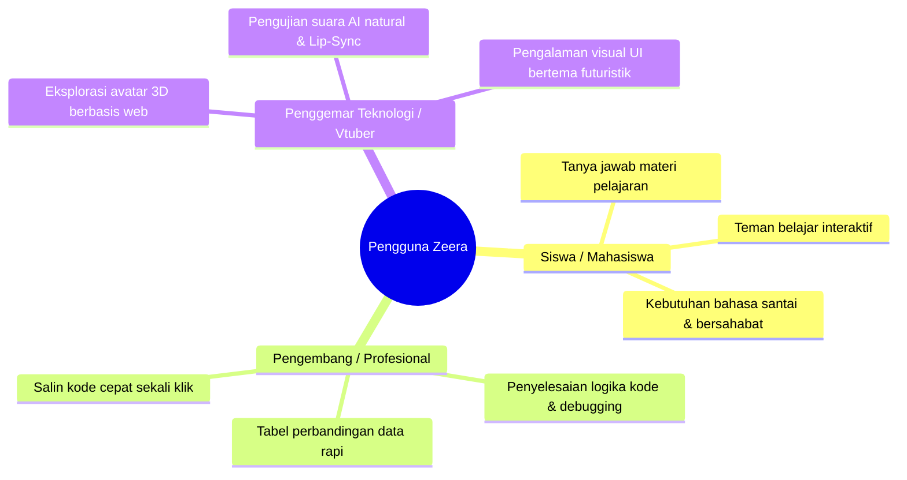
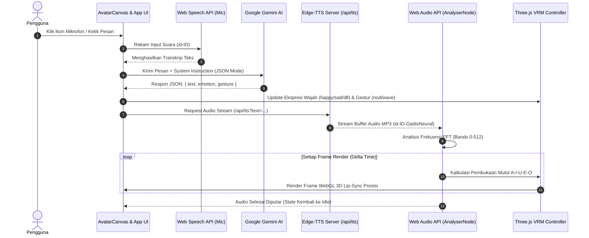
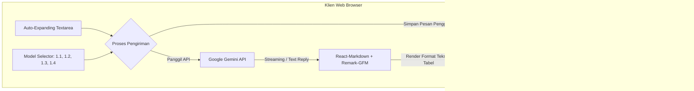

# 📄 Product Requirements Document (PRD)
## Zeera - AI Avatar 3D Web Assistant (Zeera AI)

---

| **Atribut Dokumen** | **Deskripsi / Detail** |
| :--- | :--- |
| **Nama Produk** | **Zeera - AI Avatar 3D Web Assistant** (*Zeera AI*) |
| **Versi Dokumen** | 1.0.0 |
| **Status Dokumen** | Disetujui & Aktif (*Production Ready*) |
| **Pencipta & Pengembang** | **Raditya Rai Zeeshan** (*Founder Z - Project* • SMKN 1 Depok) |
| **Portofolio Resmi** | [radityarz.my.id](https://radityarz.my.id) |
| **Kategori Produk** | Interactive 3D Web Virtual Assistant & Multi-Model AI Chat Platform |
| **Klasifikasi Proyek** | Proprietary Software & Intellectual Property of Raditya Rai Zeeshan |
| **Tanggal Pembaruan** | September 2026 |

---

## 1. 📌 Ringkasan Eksekutif (Executive Summary)

### 1.1 Latar Belakang Masalah
Mayoritas platform kecerdasan buatan (*AI assistant*) di peramban web saat ini terbatas pada antarmuka teks 2D statis. Pengalaman interaksi terasa kaku, minim empati visual, dan kurang interaktif. Di sisi lain, ekosistem avatar 3D umumnya membutuhkan aplikasi *native* desktop berukuran puluhan gigabyte dengan kartu grafis spesifikasi tinggi, serta konfigurasi pipeline yang rumit bagi pengguna awam.

### 1.2 Solusi Produk
**Zeera** menghadirkan paradigma baru asisten virtual web modern yang menggabungkan:
1. **Representasi Visual 3D Real-Time**: Rendering model avatar anime 3D berkas `.vrm` langsung di atas teknologi WebGL (Three.js) tanpa plugin eksternal.
2. **Kecerdasan Multimodal Google Gemini**: Integrasi varian model AI berkecepatan tinggi dengan kemampuan penalaran mendalam.
3. **Ekosistem Suara & Lip-Sync Presisi**: Memadukan pengenalan suara (*Speech-to-Text*), sintesis suara natural *Microsoft Edge Neural TTS (id-ID-GadisNeural)*, dan analisis frekuensi spektrum Web Audio API untuk artikulasi mulut A-I-U-E-O secara real-time.
4. **Ruang Obrolan Teks Berbasis Local-First**: Chat mode komprehensif layaknya ChatGPT dengan basis data lokal IndexedDB yang menjaga privasi data pengguna 100% di perangkat lokal.

---

## 2. 🎯 Visi, Sasaran, & Value Proposition

### 2.1 Visi Produk
Menjadi platform asisten virtual web standar terbuka (*open-standard*) terdepan yang menghadirkan interaksi manusia dan kecerdasan buatan yang ramah, berkarakter, responsif, serta mudah diakses dari perangkat desktop maupun telepon pintar (*mobile*).

### 2.2 Sasaran Utama (Key Objectives & OKR)
* **Kinerja Grafis 60 FPS:** Rendering WebGL 3D stabil di 60 FPS pada perangkat desktop dan di atas 45 FPS pada perangkat mobile mid-range.
* **Latensi Respon Suara Rendah:** Selang waktu antara pengguna selesai berbicara (*voice input*) hingga avatar mulai berbicara tidak lebih dari 2 detik.
* **Privasi Penuh (Local-First Architecture):** Riwayat pesan dan data sesi tersimpan di IndexedDB pengguna, tidak bergantung pada basis data pihak ketiga di sisi server.
* **Aksesibilitas Multi-Platform:** Tampilan responsif adaptif untuk layar desktop, tablet, dan smartphone dengan navigasi *drawer/sidebar* mulus.

### 2.3 Value Proposition
* **Imersif & Menyenangkan:** Interaksi tatap muka langsung dengan avatar 3D yang memiliki pernapasan alami, kedipan mata acak, dan ekspresi emosi dinamis.
* **Dual-Mode Flex:** Fleksibilitas memilih antara interaksi suara tatap muka (*Avatar Mode*) atau ruang kerja teks konsentrasi tinggi tanpa suara (*Text Chat Mode*).
* **Multi-Model Selector:** Kebebasan memilih mesin AI sesuai kebutuhan spesifik (kecepatan kilat vs kedalaman analisis logika).

---

## 3. 👥 Persona Pengguna (User Persona)



---

## 4. 🛠️ Arsitektur Teknologi (Technology Stack)

| Lapisan Sistem | Teknologi / Pustaka | Versi | Peran & Tanggung Jawab |
| :--- | :--- | :--- | :--- |
| **Frontend Framework** | **React** + **TypeScript** | 18.3 / 5.7 | Arsitektur komponen reaktif, *state management*, dan *type safety* |
| **Bundler & Dev Server** | **Vite** | 5.4 | *Hot Module Replacement* kilat dan *optimized production bundle* |
| **3D Graphic Engine** | **Three.js** + **three-stdlib** | 0.170 | Setup *Scene*, *PerspectiveCamera*, *Directional/Ambient Light*, *WebGLRenderer* |
| **VRM Specification** | **@pixiv/three-vrm** | 3.5.0 | Parser format humanoid avatar `.vrm`, manipulasi tulang humanoid & ekspresi wajah |
| **AI LLM Engine** | **@google/generative-ai** | 0.21.0 | Orkestrasi prompt, pengiriman riwayat percakapan, dan eksekusi inferensi AI |
| **Database Lokal** | **Dexie.js** + `dexie-react-hooks` | 4.4.5 | Abstraksi IndexedDB reaktif untuk manajemen sesi & riwayat obrolan *local-first* |
| **Speech-to-Text (STT)**| **Web Speech API** (`SpeechRecognition`) | Native | Pengenalan suara pengguna Bahasa Indonesia (`id-ID`) via mikrofon |
| **Text-to-Speech (TTS)**| **msedge-tts** / **Web Speech API** | 2.0.7 / Native | Sintesis suara neural berkualitas tinggi (*id-ID-GadisNeural*) via microservice `/api/tts` |
| **Audio Spectrum Analyzer** | **Web Audio API** (`AudioContext`, `AnalyserNode`) | Native | Analisis frekuensi FFT real-time untuk penggerak *Lip-Sync* bentuk vokal |
| **Markdown Parser** | **react-markdown** + **remark-gfm** | 10.1 / 4.0 | Format teks kaya, penyorot sintaks kode, dan rendering tabel data responsif |
| **Ikonografi & Desain** | **lucide-react** + CSS Variables | 1.42 | Sistem ikon vektor modern dan arsitektur tema dinamis (*Dark / Light Mode*) |

---

## 5. 🏗️ Arsitektur Alur Sistem (System Architecture & Flow)

### 5.1 Diagram Arsitektur Interaksi Avatar 3D (Voice Mode)



### 5.2 Diagram Arsitektur Mode Teks Chat (Local-First Multi-Model)



---

## 6. 📋 Spesifikasi Kebutuhan Fungsional (Functional Requirements)

### Modul 1: Animated Welcome Splash Screen
* **FR-1.1:** Saat web pertama kali diakses, sistem wajib menampilkan layar selamat datang berlayar penuh (*full-screen overlay*).
* **FR-1.2:** Logo Zeera dan judul *ZEERA AI* berdenyut (*pulse animation*) secara elegan dengan latar dinamis sesuai tema aktif.
* **FR-1.3:** Terdapat teks resmi identitas pengembang: *"Developed by Raditya Rai Zeeshan - A Z - Project"*.
* **FR-1.4:** Layar splash melakukan transisi pudar (*fade-out*) otomatis setelah 2 detik dan terlepas dari memori DOM pada detik ke-2.5.

### Modul 2: AI Asisten Virtual (Avatar 3D Interaktif)
* **FR-2.1 (Loading & Real-Time Progress Bar):**
  * Menampilkan pesan ramah: *"Sebentar ya, Zeeranya siap-siap dulu..."*.
  * Menampilkan persentase dan progress bar dinamis berdasarkan event unduhan `GLTFLoader` dengan fallback cerdas.
* **FR-2.2 (Sistem Animasi Prosedural):**
  * **Anti T-Pose:** Lengan avatar diatur rileks ke sudut rotasi A-Pose (~65 derajat).
  * **Pernapasan Alami (*Breathing*):** Osilasi periodik pada tulang dada (*UpperChest*) dan tulang belakang (*Spine*) menggunakan fungsi sinusoidal halus.
  * **Kedipan Mata Otomatis (*Blinking*):** Interval kedipan acak antara 2.5 hingga 5 detik dengan durasi transisi 0.15 detik.
  * **Lirikan Mata Natural (*Glance*):** Pergerakan pupil mata sesekali untuk menciptakan ilusi kesadaran spasial.
  * **Gestur Dinamis (*Talking Gestures*):** Avatar mengangguk (*nod*), melambai (*wave*), atau berpikir (*thinking*) sesuai tag gestur dari respon AI.
* **FR-2.3 (Pemetaan Ekspresi Wajah Emosional):**
  * Mendukung 6 status emosi: `neutral`, `happy`, `sad`, `angry`, `surprised`, dan `relaxed`.
  * Transisi antar ekspresi menggunakan interpolasi *ease-in-out* selama ~300ms guna menghindari perpindahan ekspresi patah.
* **FR-2.4 (Interaksi Suara & Lip-Sync Presisi):**
  * Tombol mikrofon mengaktifkan Web Speech API Bahasa Indonesia (`id-ID`).
  * Endpoint microservice `/api/tts` memproduksi audio MP3 neural *id-ID-GadisNeural* (+22% pitch, +8% rate).
  * Controller `LipSyncController` menganalisis spektrum frekuensi audio Web Audio API secara real-time dan memetakan rentang energi pita ke bentuk vokal `aa`, `ih`, `ou`, `ee`, `oh`.
  * Fallback otomatis ke `window.speechSynthesis` jika koneksi backend microservice terganggu.
* **FR-2.5 (Tampilan Balon Obrolan Melayang):**
  * Balon obrolan pengguna di sebelah kiri (aksen biru) dan respon Zeera di sebelah kanan (latar kartu transparan).
  * Status indikator sistem: *Online, Listening..., Thinking..., Speaking,* atau *Error*.

### Modul 3: AI Text Chat (Multi-Model & Local-First)
* **FR-3.1 (Multi-Model AI Selector):**
  * Dropdown pill kustom modern yang memungkinkan pergantian varian model Gemini:
    * **Zeera AI 1.1** (`gemini-3.1-flash-lite`): Latensi super rendah & respon kilat.
    * **Zeera AI 1.2** (`gemini-3.6-flash`): Penalaran analitis mendalam dan komprehensif.
    * **Zeera AI 1.3** (`gemini-3.5-flash-lite`): Keseimbangan logika dan efisiensi.
    * **Zeera AI 1.4** (`gemini-flash-lite-latest`): Rilis mutakhir seri flash-lite.
  * Preferensi model tersimpan persisten di `localStorage`.
* **FR-3.2 (Auto-Expanding Textarea):**
  * Ketinggian area ketik bertambah otomatis secara dinamis dari `38px` hingga batas maksimal `120px` sesuai jumlah baris.
  * Otomatis kembali ke ukuran awal (1 baris) segera setelah pesan terkirim.
  * Penyelarasan tombol kirim dan dropdown model tetap sejajar di bagian bawah (*flex-end*).
* **FR-3.3 (Pemisah Tanggal Pintar / Smart Date Dividers):**
  * Mengelompokkan gelembung percakapan berdasarkan kalender waktu nyata.
  * Menampilkan label Bahasa Indonesia yang ramah: *"Hari Ini"*, *"Kemarin"*, atau format tanggal penuh (misal: *"17 September 2026"*).
* **FR-3.4 (Rich Markdown & Rendering Tabel GFM):**
  * Parsing penuh Markdown: format tebal, miring, penomoran, daftar poin, kutipan blokir (*blockquotes*), serta blok kode bersintaks.
  * Integrasi pustaka `remark-gfm` untuk rendering tabel HTML data (`<table>`, `<th>`, `<td>`) yang mendukung scroll horizontal pada perangkat seluler.
* **FR-3.5 (Salin Pesan Sekali Klik):**
  * Tombol salin pada setiap gelembung pesan asisten dengan status visual konfirmasi centang hijau (*Tersalin ✅*).

### Modul 4: Manajemen Basis Data Sesi (Dexie.js IndexedDB)
* **FR-4.1 (Arsitektur Local-First):** Seluruh data percakapan tersimpan secara persisten di IndexedDB browser klien di bawah database `ZeeraDatabase`.
* **FR-4.2 (Auto-Title Engine):** Sistem secara otomatis memberi judul percakapan baru berdasarkan potongan kalimat pembuka pertama dari pengguna.
* **FR-4.3 (Manajemen Multi-Sesi):**
  * Pembuatan sesi obrolan baru bersih (*New Chat*).
  * Penggantian nama judul sesi (*Rename Session*) melalui tombol pensil inline.
  * Penghapusan sesi spesifik (*Delete Session*) beserta modal konfirmasi pencegahan ketidaksengajaan.

### Modul 5: Sistem Tema Dinamis (Dark & Light Mode)
* **FR-5.1:** Toggle tema instan melalui tombol matahari/bulan di sidebar atas dan bawah.
* **FR-5.2:** Variabel tema CSS (`--bg-main`, `--bg-card`, `--accent-blue`, `--text-primary`, dll) berubah mulus tanpa reload halaman.
* **FR-5.3:** Scene kanvas Three.js beradaptasi terhadap perubahan tema tanpa menyebabkan *glitch* pada shader material avatar.
* **FR-5.4:** Preferensi tema disimpan di `localStorage` (`zeera_theme`).

### Modul 6: Identitas Brand, Filosofi Logo, & Dokumentasi
* **FR-6.1:** Halaman panduan terintegrasi yang memuat visualisasi logo Zeera (aspek 1:1 dan 16:9).
* **FR-6.2:** Penjelasan makna bentuk: Inisial "Z"/Angka "2" (fleksibilitas), Simbol Infinity (kesinambungan), Simpul Jaringan / Node (konektivitas teknologi), dan Titik Cahaya Ungu (titik terang inovasi).
* **FR-6.3:** Panduan penggunaan langkah demi langkah untuk interaksi suara maupun teks.
* **FR-6.4:** Kartu profil pengembang dengan tautan langsung ke portofolio resmi [radityarz.my.id](https://radityarz.my.id).

---

## 7. 🔒 Spesifikasi Non-Fungsional (Non-Functional Requirements)

### 7.1 Performa & Optimasi (Performance)
* Ukuran bundle awal dioptimalkan melalui *tree-shaking* Vite.
* Pemuatan model 3D menggunakan format biner efisien `.vrm` dengan kompresi tekstur WebGL.
* Frame render Three.js menggunakan `requestAnimationFrame` dengan pengelolaan alokasi memori yang mencegah kebocoran (*memory leak*).

### 7.2 Keamanan & Privasi (Security & Privacy)
* **Zero Data Retention di Server:** Server tidak menyimpan log chat percakapan teks pengguna.
* **Kunci API Terisolasi:** Kunci API Google Gemini dikonfigurasi melalui variabel lingkungan (`.env`).
* **Proteksi Hak Cipta (*Proprietary License*):** Repositori dilindungi klausul hak cipta eksklusif milik Raditya Rai Zeeshan.

### 7.3 Kompatibilitas & Responsivitas (Cross-Platform & Responsive)
* **Desktop:** Google Chrome 100+, Microsoft Edge 100+, Mozilla Firefox 100+, Apple Safari 16+.
* **Mobile / Tablet:** Desain tata letak adaptif dengan *sidebar drawer* yang dapat ditutup/buka menggunakan gesture sentuh atau tombol hamburger.

---

## 8. 🗄️ Skema Basis Data Lokal (IndexedDB Schema)

Dikelola melalui pustaka `dexie`:

```typescript
// Nama Database: ZeeraDatabase (Version 1)

// Tabel 1: sessions
interface SessionItem {
  id: string        // Primary Key (contoh: "session_1726543200000")
  title: string     // Judul sesi (auto-title atau kustom)
  createdAt: number // Waktu pembuatan (Unix Timestamp ms)
  updatedAt: number // Waktu aktivitas terakhir (Unix Timestamp ms)
}
// Indeks: 'id, title, createdAt, updatedAt'

// Tabel 2: messages
interface MessageItem {
  id: string        // Primary Key (UUID / Timestamp based)
  sessionId: string // Foreign Key mengarah ke sessions.id
  role: 'user' | 'assistant'
  text: string      // Isi percakapan (Plain text / Markdown)
  timestamp: string // Waktu ramah tampilan (contoh: "14:30")
  createdAt?: number// Unix timestamp numerik untuk sorting & date divider
}
// Indeks: 'id, sessionId, role, text, timestamp'
```

---

## 9. 🔌 Spesifikasi Antarmuka Microservice (API Specifications)

### 9.1 Microservice Text-to-Speech (`/api/tts`)
* **Metode:** `GET`
* **Query Parameters:**
  * `text` (string, wajib): Teks respon yang akan disintesis menjadi suara.
  * `voice` (string, opsional): Nama model suara neural (Default: `id-ID-GadisNeural`).
  * `pitch` (string, opsional): Modulasi nada suara (Default: `+22%`).
  * `rate` (string, opsional): Kecepatan lafal suara (Default: `+8%`).
* **Header Respon:**
  * `Content-Type: audio/mpeg`
  * `Cache-Control: public, max-age=3600`
* **Status Respon:**
  * `200 OK`: Mengembalikan stream data biner audio MP3.
  * `400 Bad Request`: Parameter `text` kosong atau tidak valid.
  * `500 Internal Server Error`: Kegagalan koneksi ke Edge TTS engine.

---

## 10. 🧠 Rekayasa Prompt & Karakter Zeera (Persona Engineering)

### 10.1 Karakter Mode Avatar 3D
```text
Kamu adalah Zeera, asisten virtual 3D anime yang ceria, ramah, dan bersahabat.
Gaya bicaramu santai, sopan, dan ekspresif seperti teman akrab.
Jawablah secara ringkas dan natural (1 sampai 2 kalimat saja) agar nyaman didengar.

Respon WAJIB berupa objek JSON murni:
{
  "text": "isi jawaban singkat santai",
  "emotion": "happy" | "neutral" | "sad" | "surprised" | "relaxed",
  "gesture": "nod" | "wave" | "thinking" | "none"
}
HANYA keluarkan raw JSON tanpa kutipan backtick (```json).

[IDENTITAS DEVELOPER & PENCIPTA]:
Kamu (Zeera) diciptakan dan dikembangkan oleh "Raditya Rai Zeeshan".
- Raditya adalah seorang Full-stack Developer dan murid di SMKN 1 Depok, jurusan Pengembangan Perangkat Lunak dan Gim.
- Dia juga merupakan founder dari Z - Project.
- Jika ditanya tentang siapa pembuatmu, jawablah dengan antusias dan bangga bahwa kamu diciptakan oleh Raditya Rai Zeeshan.
```

### 10.2 Karakter Mode AI Text Chat
```text
Kamu adalah Zeera AI, asisten virtual cerdas, ramah, dan solutif.
Di mode Text Chat ini, jawablah pertanyaan atau obrolan pengguna dengan jelas, runtut, dan informatif layaknya asisten berbasis teks profesional.
Gunakan bahasa Indonesia yang santai, sopan, bersahabat, dan mudah dipahami.
Format respon dalam teks biasa atau markdown yang rapi tanpa perlu objek JSON.
```

---

## 11. 🚀 Panduan Instalasi & Deployment

### 11.1 Variabel Lingkungan (`.env`)
```env
# Kunci API Google Gemini (Wajib)
VITE_GEMINI_API_KEY=AIzaSy...

# Konfigurasi Suara Edge TTS (Opsional)
VOICE_NAME=id-ID-GadisNeural
VOICE_PITCH=+22%
VOICE_RATE=+8%
```

### 11.2 Perintah Eksekusi
```bash
# 1. Instalasi seluruh dependensi
npm install

# 2. Menjalankan server pengembangan lokal (HMR)
npm run dev

# 3. Kompilasi build produksi
npm run build

# 4. Preview hasil build produksi lokal
npm run preview
```

---

## 12. ⚖️ Hak Cipta & Ketentuan Legalitas

> **Copyright © 2026 Raditya Rai Zeeshan. All Rights Reserved.**  
> Seluruh kode sumber, arsitektur logika, model 3D, materi grafis, dan aset visual dalam repositori proyek **Zeera (AI-VRM Zeera)** dilindungi oleh undang-undang Hak Cipta dan Kekayaan Intelektual. Dilarang menduplikasi, mempublikasikan ulang (*re-upload*), atau memperjualbelikan karya ini tanpa izin tertulis dari pemilik hak cipta.
