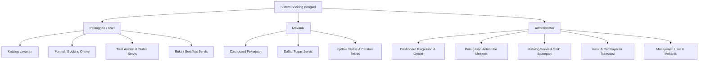
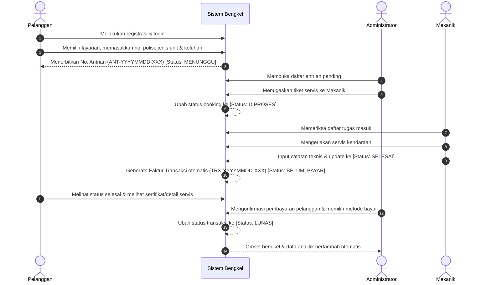
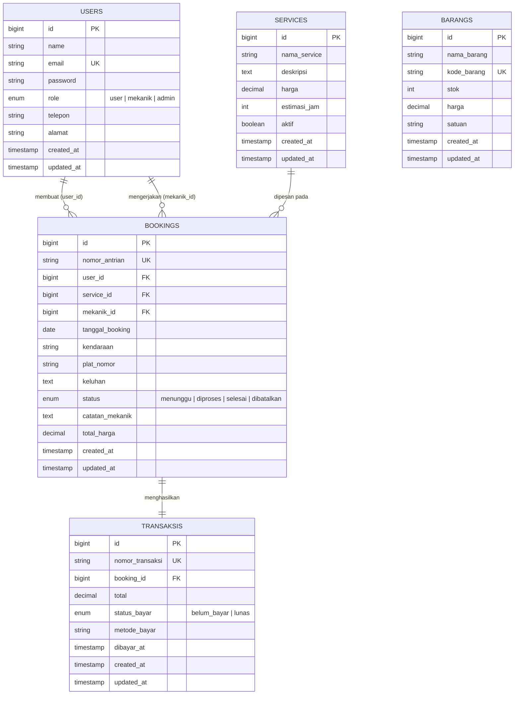

# PRODUCT REQUIREMENTS DOCUMENT (PRD)
## SISTEM MANAJEMEN BOOKING SERVICE BENGKEL (3-ROLE)

---

### Informasi Dokumen
| Atribut | Keterangan |
| :--- | :--- |
| **Nama Produk / Proyek** | Sistem Booking Service Bengkel (3-Role) |
| **Versi Dokumen** | v1.0.0 |
| **Status** | Approved / Baseline Implemented |
| **Tanggal Terbit** | September 2026 |
| **Tech Stack Utama** | Laravel 13 (PHP 8.3+), MySQL, Blade Template Engine, Glassmorphism UI |
| **Target Pengguna** | Pelanggan Bengkel (User), Mekanik, Admin / Pemilik Bengkel |

---

## 1. Ringkasan Eksekutif (Executive Summary)

### 1.1 Latar Belakang
Operasional bengkel konvensional sering mengalami inefisiensi akibat:
1. **Penumpukan Antrian Fisik:** Pelanggan harus datang langsung tanpa kepastian waktu tunggu atau ketersediaan teknisi/mekanik.
2. **Penugasan Kerja Manual:** Pembagian unit kendaraan ke mekanik tidak tercatat rapi, memicu ketidakseimbangan beban kerja teknisi.
3. **Pencatatan Keuangan Terpisah:** Faktur dan riwayat pembayaran sering tidak sinkron dengan jenis servis dan suku cadang yang digunakan.
4. **Kurangnya Transparansi Status:** Pelanggan tidak dapat memantau apakah kendaraannya sedang dikerjakan atau sudah selesai secara real-time.

### 1.2 Visi & Solusi Produk
Membangun aplikasi web berbasis peran terpadu (*3-Role Web Application*) yang menghubungkan Pelanggan, Mekanik, dan Administrator dalam satu siklus layanan servis terotomatisasi:
- Pelanggan dapat memilih jenis layanan servis, menentukan jadwal booking, dan mendapatkan nomor antrian otomatis secara mandiri.
- Administrator memvalidasi antrian dan menugaskan mekanik yang tersedia.
- Mekanik memperbarui progres pengerjaan secara transparan dan memberikan catatan teknis.
- Sistem secara otomatis menerbitkan dokumen transaksi saat servis selesai untuk diselesaikan di kasir/admin.

### 1.3 Sasaran Bisnis & Metrik Keberhasilan (KPI)
| Sasaran Bisnis | Metrik Keberhasilan (KPI) | Target |
| :--- | :--- | :--- |
| Reduksi Waktu Tunggu | Waktu antrian fisik di area bengkel | Berkurang hingga 40% |
| Utilisasi Mekanik | Efisiensi penugasan servis per mekanik | 100% terekam dalam sistem |
| Akurasi Transaksi | Kesesuaian tagihan servis dengan pembayaran | 0% selisih invoice |
| Retensi Pelanggan | Aksesibilitas riwayat dan kepuasan booking | Peningkatan repeat customer > 25% |

---

## 2. Pengguna & Matriks Hak Akses (User Personas & RBAC)

Sistem mengadopsi kontrol akses berbasis peran (*Role-Based Access Control / RBAC*) dengan 3 tingkatan peran:



### 2.1 Profil Pengguna
1. **Pelanggan (User):**
   - Mendaftar secara mandiri melalui portal registrasi publik.
   - Melakukan eksplorasi katalog servis, melakukan booking servis dengan mengisi data kendaraan dan keluhan.
   - Memantau nomor antrian, status pengerjaan, membatalkan antrian sebelum diproses, dan melihat sertifikat servis setelah unit selesai.
2. **Mekanik:**
   - Didaftarkan secara eksklusif oleh Admin bengkel (tidak dapat mendaftar mandiri).
   - Melihat penugasan servis unit kendaraan yang masuk ke dirinya.
   - Mengubah status pengerjaan (`diproses` -> `selesai`) dan melampirkan catatan rekomendasi mekanik.
3. **Administrator:**
   - Pengelola operasional harian dan kasir bengkel.
   - Menetapkan penugasan mekanik pada setiap tiket antrian yang masuk.
   - Mengelola master data layanan/jasa dan suku cadang (*sparepart*).
   - Memproses pelunasan kasir dan mengawasi analitik pendapatan bengkel.

### 2.2 Matriks Hak Akses (RBAC Matrix)

| Modul / Fitur | Tamu (Guest) | Pelanggan (`user`) | Mekanik (`mekanik`) | Administrator (`admin`) |
| :--- | :---: | :---: | :---: | :---: |
| Halaman Login & Registrasi |  | - (Redirect) | - (Redirect) | - (Redirect) |
| Dashboard Ringkasan Pribadi | - |  |  |  |
| Katalog Layanan Jasa | - |  | - |  (Kelola CRUD) |
| Buat Booking Servis | - |  | - | - |
| Lihat Tiket Antrian & Detail Sendiri | - |  | - | - |
| Batalkan Booking (Status: `menunggu`) | - |  | - | - |
| Lihat Bukti / Sertifikat Servis Selesai | - |  | - | - |
| Lihat Penugasan Servis Mekanik | - | - |  |  (Semua) |
| Update Progres Servis & Catatan Teknis | - | - |  | - |
| Tugaskan Mekanik ke Antrian | - | - | - |  |
| Kelola Data Suku Cadang (Barang) | - | - | - |  (CRUD) |
| Kelola Akun Mekanik | - | - | - |  (Create/Delete) |
| Monitoring Riwayat Pelanggan | - | - | - |  |
| Kasir & Pelunasan Transaksi | - | - | - |  |

---

## 3. Alur Kerja & Proses Bisnis (Business Process Flow)

### 3.1 Siklus Hidup Servis (End-to-End Flow)



### 3.2 State Machine: Status Booking & Transaksi

#### A. Status Booking
- `menunggu`: Booking baru dibuat oleh user. Pelanggan dapat membatalkan pesanan.
- `diproses`: Admin telah mengalokasikan mekanik untuk kendaraan terkait.
- `selesai`: Mekanik telah merampungkan servis. Faktur pembayaran diterbitkan.
- `dibatalkan`: Booking dibatalkan oleh pelanggan sebelum ditugaskan ke mekanik.

#### B. Status Transaksi
- `belum_bayar`: Transaksi dibuat otomatis saat servis dinyatakan `selesai`.
- `lunas`: Admin kasir telah menerima pembayaran dan mencatatkan metode bayar.

---

## 4. Spesifikasi Kebutuhan Fungsional (Functional Requirements)

### 4.1 Modul Autentikasi & Pengelolaan Sesi (FR-AUTH)
- **FR-AUTH-001:** Sistem menyediakan formulir registrasi untuk pelanggan baru (`name`, `email`, `password`, `password_confirmation`, `telepon`, `alamat`).
- **FR-AUTH-002:** Password wajib dienkripsi menggunakan algoritma *Bcrypt* / Laravel standard hash sebelum disimpan di basis data.
- **FR-AUTH-003:** Sistem melakukan validasi keunikan email pelanggan (`unique:users`).
- **FR-AUTH-004:** Mekanisme login memvalidasi kredensial pengguna dan mengimplementasikan *Session Regeneration* guna mencegah serangan *Session Fixation*.
- **FR-AUTH-005:** Sistem secara cerdas mengarahkan (*auto-redirect*) pengguna ke dashboard sesuai perannya setelah proses autentikasi berhasil:
  - Role `admin`  `/admin/dashboard`
  - Role `mekanik`  `/mekanik/dashboard`
  - Role `user`  `/user/dashboard`
- **FR-AUTH-006:** Sistem membatasi rute URL menggunakan middleware peran kustom (`RoleMiddleware`). Akses lintas peran yang tidak berhak akan langsung dibatalkan dengan kode HTTP `403 Forbidden`.

### 4.2 Modul Portal Pelanggan / User (FR-USER)
- **FR-USER-001 (Katalog Jasa):** Pelanggan dapat melihat daftar layanan servis aktif, lengkap dengan estimasi jam pengerjaan, deskripsi, dan tarif harga.
- **FR-USER-002 (Booking Service):** Pelanggan dapat membuat janji servis dengan memilih layanan, tanggal booking (wajib `>= hari ini`), data merk/tipe kendaraan, nomor plat polisi, dan uraian keluhan.
- **FR-USER-003 (Auto-Numbering Antrian):** Sistem membuat kode antrian unik harian secara otomatis dengan pola:  
  `ANT-{YYYYMMDD}-{URUTAN_3_DIGIT}` (Contoh: `ANT-20260917-001`).
- **FR-USER-004 (Format Plat Nomor):** Input plat nomor secara otomatis diformat menjadi huruf kapital standar (`strtoupper`).
- **FR-USER-005 (Isolasi Data Booking):** Pelanggan hanya diizinkan melihat riwayat booking milik akunnya sendiri. Akses ID booking orang lain ditolak secara eksplisit (`HTTP 403`).
- **FR-USER-006 (Pembatalan Mandiri):** Pelanggan dapat membatalkan booking hanya jika status tiket masih berstatus `menunggu`. Tiket yang sudah berstatus `diproses` atau `selesai` tidak dapat dibatalkan.
- **FR-USER-007 (Bukti/Sertifikat Servis):** Pelanggan dapat mencetak atau melihat sertifikat/ringkasan servis setelah pengerjaan berstatus `selesai`.

### 4.3 Modul Portal Mekanik (FR-MEK)
- **FR-MEK-001 (Dashboard Tugas):** Mekanik dapat melihat ringkasan tugas aktif (`menunggu` dan `diproses`) serta total akumulasi servis yang telah berhasil diselesaikan.
- **FR-MEK-002 (Daftar Penugasan Servis):** Mekanik dapat melihat daftar detail unit kendaraan yang didelegasikan oleh Admin kepadanya (informasi pemilik, merk kendaraan, plat nomor, jenis servis, keluhan).
- **FR-MEK-003 (Pembaruan Progres):** Mekanik dapat mengubah status pekerjaan menjadi `diproses` atau `selesai`.
- **FR-MEK-004 (Catatan Teknis Mekanik):** Mekanik dapat menyematkan catatan perbaikan dan rekomendasi perawatan pada tiket servis.
- **FR-MEK-005 (Trigger Transaksi Otomatis):** Ketika mekanik menyetel status booking menjadi `selesai`, sistem secara otomatis membuat *record* baru pada tabel `transaksis` dengan status awal `belum_bayar`.

### 4.4 Modul Portal Administrator (FR-ADM)
- **FR-ADM-001 (Dashboard Eksekutif):** Menampilkan metrik ringkasan performa bengkel:
  - Total jumlah booking keseluruhan.
  - Jumlah booking per status (`menunggu`, `diproses`, `selesai`).
  - Total pelanggan terdaftar.
  - Total mekanik aktif.
  - Akumulasi total pendapatan kotor dari transaksi yang berstatus `lunas`.
  - Daftar 5 booking terbaru.
- **FR-ADM-002 (Penugasan Mekanik):** Admin dapat memetakan tiket booking berstatus `menunggu` ke mekanik yang tersedia. Sistem langsung mengubah status booking menjadi `diproses`.
- **FR-ADM-003 (Master Data Layanan/Service):** Admin memiliki wewenang penuh (CRUD) atas katalog jasa bengkel (nama layanan, tarif harga, estimasi durasi kerja, deskripsi, dan status keaktifan).
- **FR-ADM-004 (Master Data Barang & Sparepart):** Admin memiliki wewenang penuh (CRUD) mengelola inventaris suku cadang (nama barang, kode unik barang, jumlah stok, harga satuan, dan satuan unit).
- **FR-ADM-005 (Manajemen Data Mekanik):** Admin dapat menambahkan akun mekanik baru (nama, email, password, no. telepon) dan menghapus akun mekanik.
- **FR-ADM-006 (Monitoring Pelanggan):** Admin dapat melihat daftar seluruh pelanggan terdaftar beserta penghitung jumlah transaksi servis yang pernah mereka buat (`withCount('bookings')`).
- **FR-ADM-007 (Kasir & Konfirmasi Pembayaran):** Admin dapat melihat seluruh daftar transaksi, memilih metode pembayaran yang digunakan pelanggan (e.g. Tunai, Transfer Bank, QRIS), dan melunasi transaksi. Sistem mencatatkan timestamp pelunasan (`dibayar_at`) secara otomatis.

---

## 5. Kebutuhan Non-Fungsional (Non-Functional Requirements)

| Kategori | Parameter | Spesifikasi & Standar yang Diterapkan |
| :--- | :--- | :--- |
| **Keamanan (Security)** | Enkripsi Sandi | Algoritma *Bcrypt* dengan cost factor standar Laravel. |
| | Proteksi Request | Seluruh form HTTP mutasi (`POST`, `PUT`, `DELETE`) dilindungi token `@csrf`. |
| | Proteksi Akses Data | Pemeriksaan kepemilikan data (`abort_if($booking->user_id !== Auth::id(), 403)`). |
| | Role Segregation | Pengecekan multi-parameter pada middleware kernel. |
| **Performa (Performance)** | Waktu Respons | Rendering halaman server-side Blade `< 300ms` pada kondisi jaringan lokal. |
| | Query Optimization | Penggunaan Eager Loading (`with('user', 'service')`) untuk mencegah masalah *N+1 Query*. |
| **Keandalan (Reliability)** | Konsistensi Data | Integritas referensial Foreign Key dengan aturan `cascade` dan `set null`. |
| | Penomoran Transaksi | Skema generator unik berbasis tanggal dan counter harian untuk mencegah tabrakan ID antrian/faktur. |
| **Antarmuka (UI/UX)** | Gaya Tampilan | Modern Glassmorphism (CSS backdrop-filter blur, dynamic gradients, transisi halus). |
| | Responsivitas | Tampilan fleksibel untuk perangkat desktop, tablet, dan smartphone. |
| | Visual Feedback | Animasi *Page Loader* mekanik berbasis roda gigi (*rotating gear loader*) saat transisi halaman. |

---

## 6. Arsitektur Teknis & Skema Database

### 6.1 Diagram Hubungan Entitas (ERD - Entity Relationship Diagram)



### 6.2 Kamus Data (Data Dictionary)

#### 1. Tabel `users`
Menyimpan kredensial dan identitas semua aktor pengguna sistem.
| Nama Kolom | Tipe Data | Keterangan & Batasan |
| :--- | :--- | :--- |
| `id` | BIGINT (Auto Increment, PK) | Identifier unik pengguna. |
| `name` | VARCHAR(255) | Nama lengkap pengguna / mekanik. |
| `email` | VARCHAR(255) (Unique) | Alamat email resmi untuk autentikasi. |
| `password` | VARCHAR(255) | String hash kata sandi. |
| `role` | ENUM('user', 'admin', 'mekanik') | Peran sistem (Default: `'user'`). |
| `telepon` | VARCHAR(255) (Nullable) | Nomor telepon / kontak aktif. |
| `alamat` | VARCHAR(255) (Nullable) | Alamat tempat tinggal / domisili. |

#### 2. Tabel `services`
Menyimpan daftar layanan jasa pemeliharaan/perbaikan kendaraan.
| Nama Kolom | Tipe Data | Keterangan & Batasan |
| :--- | :--- | :--- |
| `id` | BIGINT (Auto Increment, PK) | Identifier layanan. |
| `nama_service` | VARCHAR(100) | Judul jasa servis (e.g. Ganti Oli Mesin, Tune Up). |
| `deskripsi` | TEXT (Nullable) | Penjelasan cakupan servis. |
| `harga` | DECIMAL(10, 2) | Tarif biaya dasar servis. |
| `estimasi_jam` | INT | Perkiraan durasi kerja dalam satuan jam. |
| `aktif` | BOOLEAN | Status ketersediaan jasa (`true`/`false`). |

#### 3. Tabel `barangs`
Menyimpan inventaris suku cadang (*sparepart*) bengkel.
| Nama Kolom | Tipe Data | Keterangan & Batasan |
| :--- | :--- | :--- |
| `id` | BIGINT (Auto Increment, PK) | Identifier barang. |
| `nama_barang` | VARCHAR(100) | Nama suku cadang (e.g. Filter Udara, Oli Matic). |
| `kode_barang` | VARCHAR(255) (Unique) | Barcode / SKU unik barang. |
| `stok` | INT | Jumlah fisik barang di bengkel. |
| `harga` | DECIMAL(10, 2) | Harga jual retail barang. |
| `satuan` | VARCHAR(20) | Satuan unit barang (e.g. Liter, Pcs, Set). |

#### 4. Tabel `bookings`
Menyimpan catatan permohonan reservasi servis kendaraan oleh pelanggan.
| Nama Kolom | Tipe Data | Keterangan & Batasan |
| :--- | :--- | :--- |
| `id` | BIGINT (Auto Increment, PK) | Identifier transaksi booking. |
| `nomor_antrian` | VARCHAR(255) (Unique) | Kode tiket antrian harian (`ANT-YYYYMMDD-XXX`). |
| `user_id` | BIGINT (FK -> users.id) | Pemilik kendaraan yang memesan. |
| `service_id` | BIGINT (FK -> services.id) | Jenis layanan yang dipesan. |
| `mekanik_id` | BIGINT (FK -> users.id, Nullable)| Teknisi yang ditugaskan mengerjakan. |
| `tanggal_booking` | DATE | Tanggal kedatangan yang dipilih pelanggan. |
| `kendaraan` | VARCHAR(255) | Merk, model, tipe kendaraan. |
| `plat_nomor` | VARCHAR(255) | Nomor registrasi polisi (Kapital). |
| `keluhan` | TEXT (Nullable) | Gejala kerusakan yang dikeluhkan pelanggan. |
| `status` | ENUM | `'menunggu'`, `'diproses'`, `'selesai'`, `'dibatalkan'`. |
| `catatan_mekanik` | TEXT (Nullable) | Diagnosa & rekomendasi dari mekanik. |
| `total_harga` | DECIMAL(10, 2) | Total biaya servis yang ditagihkan. |

#### 5. Tabel `transaksis`
Menyimpan data faktur pembayaran dan pelunasan kasir.
| Nama Kolom | Tipe Data | Keterangan & Batasan |
| :--- | :--- | :--- |
| `id` | BIGINT (Auto Increment, PK) | Identifier faktur transaksi. |
| `nomor_transaksi` | VARCHAR(255) (Unique) | Nomor invoice resmi (`TRX-YYYYMMDD-XXX`). |
| `booking_id` | BIGINT (FK -> bookings.id) | Relasi ke tiket booking yang diselesaikan. |
| `total` | DECIMAL(10, 2) | Nominal yang harus dibayarkan pelanggan. |
| `status_bayar` | ENUM('belum_bayar', 'lunas') | Status verifikasi pembayaran kasir. |
| `metode_bayar` | VARCHAR(255) (Nullable) | Jalur transaksi (e.g. Cash, Transfer, QRIS). |
| `dibayar_at` | TIMESTAMP (Nullable) | Waktu saat admin mengesahkan status lunas. |

---

## 7. Arsitektur Route & Antarmuka API Internal

### 7.1 Autentikasi & Rute Publik
| Method | Endpoint URI | Controller & Method | Deskripsi |
| :--- | :--- | :--- | :--- |
| `GET` | `/login` / `/` | `AuthController@showLogin` | Halaman form login pengguna. |
| `POST` | `/login` | `AuthController@login` | Validasi kredensial & inisialisasi sesi. |
| `GET` | `/register` | `AuthController@showRegister` | Halaman pendaftaran pelanggan baru. |
| `POST` | `/register` | `AuthController@register` | Menyimpan user baru role `user`. |
| `POST` | `/logout` | `AuthController@logout` | Menghancurkan sesi aktif pengguna. |
| `GET` | `/dashboard` | `AuthController@dashboard` | Pintu gerbang routing dashboard sesuai role. |

### 7.2 Rute Pelanggan (`prefix: /user`, `role: user`)
| Method | Endpoint URI | Controller & Method | Deskripsi |
| :--- | :--- | :--- | :--- |
| `GET` | `/user/dashboard` | `UserController@dashboard` | Ringkasan akun & 5 riwayat booking terakhir. |
| `GET` | `/user/jasa` | `UserController@jasaIndex` | Galeri informasi jenis layanan servis aktif. |
| `GET` | `/user/booking` | `UserController@bookingIndex` | Daftar riwayat seluruh tiket booking milik user. |
| `GET` | `/user/booking/buat` | `UserController@bookingCreate` | Halaman formulir pembuatan reservasi baru. |
| `POST` | `/user/booking` | `UserController@bookingStore` | Menyimpan reservasi & generate no. antrian. |
| `GET` | `/user/booking/{id}` | `UserController@bookingShow` | Halaman detail tiket & progres servis. |
| `GET` | `/user/booking/{id}/sertifikat`| `UserController@bookingSertifikat` | Halaman bukti tanda selesai pengerjaan servis. |
| `POST` | `/user/booking/{id}/batal` | `UserController@bookingCancel` | Membatalkan reservasi (status `menunggu`). |

### 7.3 Rute Mekanik (`prefix: /mekanik`, `role: mekanik`)
| Method | Endpoint URI | Controller & Method | Deskripsi |
| :--- | :--- | :--- | :--- |
| `GET` | `/mekanik/dashboard` | `MekanikController@dashboard` | Statistik tugas & daftar antrian aktif mekanik. |
| `GET` | `/mekanik/service` | `MekanikController@daftarService`| Seluruh daftar unit servis yang ditugaskan. |
| `POST` | `/mekanik/service/{id}/status`| `MekanikController@updateStatus` | Update status kerja & simpan catatan mekanik. |

### 7.4 Rute Administrator (`prefix: /admin`, `role: admin`)
| Method | Endpoint URI | Controller & Method | Deskripsi |
| :--- | :--- | :--- | :--- |
| `GET` | `/admin/dashboard` | `AdminController@dashboard` | Dashboard analitik operasional & total omset. |
| `GET` | `/admin/booking` | `AdminController@bookingIndex` | Manajemen antrian servis masuk. |
| `POST` | `/admin/booking/{id}/assign` | `AdminController@bookingAssign`| Mendelegasikan tiket servis ke mekanik tertentu. |
| `GET` | `/admin/service` | `AdminController@serviceIndex` | Tabel daftar master data layanan servis. |
| `POST` | `/admin/service` | `AdminController@serviceStore` | Menambah opsi layanan servis baru. |
| `PUT` | `/admin/service/{id}` | `AdminController@serviceUpdate` | Memperbarui tarif, durasi, atau status servis. |
| `DELETE`| `/admin/service/{id}` | `AdminController@serviceDestroy`| Menghapus layanan dari katalog. |
| `GET` | `/admin/barang` | `AdminController@barangIndex` | Tabel inventaris stok suku cadang. |
| `POST` | `/admin/barang` | `AdminController@barangStore` | Menambahkan stok barang/sparepart baru. |
| `PUT` | `/admin/barang/{id}` | `AdminController@barangUpdate` | Memperbarui jumlah stok & harga jual barang. |
| `DELETE`| `/admin/barang/{id}` | `AdminController@barangDestroy`| Menghapus barang dari inventaris. |
| `GET` | `/admin/pelanggan` | `AdminController@pelangganIndex` | Rekapitulasi daftar pelanggan bengkel. |
| `GET` | `/admin/mekanik` | `AdminController@mekanikIndex` | Rekapitulasi akun mekanik & jumlah tugas. |
| `POST` | `/admin/mekanik` | `AdminController@mekanikStore` | Mendaftarkan akun mekanik baru. |
| `DELETE`| `/admin/mekanik/{id}` | `AdminController@mekanikDestroy`| Menonaktifkan/menghapus akun mekanik. |
| `GET` | `/admin/transaksi` | `AdminController@transaksiIndex` | Pembukuan transaksi & penagihan kasir. |
| `POST` | `/admin/transaksi/{id}/lunas` | `AdminController@transaksiLunas`| Konfirmasi pembayaran & cetak lunas. |

---

## 8. Logika Bisnis & Penanganan Kondisi Khusus (Business Rules & Edge Cases)

1. **Aturan Hak Cipta & Isolasi Data Antar Pelanggan:**
   - Pelanggan $A$ tidak boleh mengakses data tiket servis pelanggan $B$ meskipun mengetahui format URL `/user/booking/{id}`. Sistem memicu `abort_if($booking->user_id !== Auth::id(), 403)`.
2. **Kondisi Khusus Pembatalan Antrian:**
   - Pembatalan hanya sah dilakukan saat status antrian masih berada di level `menunggu`. Jika status sudah berpindah ke `diproses` (sedang dikerjakan mekanik) atau `selesai`, sistem mengembalikan respon `400 Bad Request`.
3. **Penerbitan Invoice Otomatis:**
   - Administrator tidak perlu menginput transaksi secara manual. Begitu mekanik menekan tombol status `selesai`, data transaksi otomatis terbentuk di background sehingga meminimalisir kelupaan tagihan (*unbilled jobs*).
4. **Perhitungan Omset Real:**
   - Metrik total pendapatan di dashboard admin hanya menghitung transaksi yang `status_bayar`-nya bernilai `lunas`. Transaksi berstatus `belum_bayar` tidak diakui sebagai pendapatan cair.
5. **Pembuatan Akun Mekanik:**
   - Mekanik dan Admin tidak diizinkan registrasi via formulir `/register`. Akun mekanik hanya dapat diterbitkan oleh Admin via panel `/admin/mekanik` untuk menjaga kredibilitas staf internal bengkel.

---

## 9. Rencana Pengembangan Masa Depan (Product Roadmap)

### Fase 1: Rilis Saat Ini (v1.0 - Baseline Selesai)
- [x] Sistem autentikasi 3-role dengan RBAC Middleware.
- [x] Form booking pelanggan interaktif dengan generator kode antrian otomatis.
- [x] Dashboard penugasan admin ke mekanik.
- [x] Portal kerja mekanik dan otomatisasi pencatatan invoice.
- [x] Manajemen kasir manual (verifikasi tunai/transfer oleh admin).
- [x] CRUD master data Service, Barang, dan Akun Mekanik.

### Fase 2: Rencana Peningkatan (v1.1 - Maintenance & Automation)
- [ ] **Integrasi Pengurangan Stok Otomatis:** Menghubungkan suku cadang yang digunakan selama servis agar langsung memotong jumlah stok di tabel `barangs`.
- [ ] **Export Dokumen PDF:** Cetak struk pembayaran resmi kasir (*Invoice PDF*) dan sertifikat servis dalam format dokumen cetak standar A4.
- [ ] **Notifikasi Real-Time (WhatsApp Gateway):** Notifikasi otomatis via Fonnte/Twilio ke nomor WhatsApp pelanggan saat status kendaraan berubah menjadi `diproses` dan `selesai`.

### Fase 3: Rencana Skalabilitas Lanjut (v2.0 - Digital Ecosystem)
- [ ] **Integrasi Payment Gateway:** Pembayaran mandiri oleh pelanggan menggunakan QRIS, GoPay, OVO, Virtual Account via Midtrans / Xendit.
- [ ] **Sistem Rating & Ulasan Mekanik:** Pelanggan dapat memberikan bintang 1-5 dan testimoni atas hasil kerja mekanik.
- [ ] **Grafik Keuangan Interaktif:** Analitik tren omset bulanan dan jasa terlaris menggunakan Chart.js di dashboard Admin.

---

## 10. Panduan Pengujian & Deployment

### 10.1 Akun Uji Coba Default (Seeder Credential)
| Role | Email | Password Default | Keterangan |
| :--- | :--- | :--- | :--- |
| **Admin** | `admin@bengkel.com` | `password` | Akun Superuser / Pengelola Bengkel |
| **Mekanik 1** | `budi@bengkel.com` | `password` | Teknisi Senior |
| **Mekanik 2** | `andi@bengkel.com` | `password` | Teknisi Umum |
| **Mekanik 3** | `riko@bengkel.com` | `password` | Teknisi Spesialis Ban/Rem |
| **Pelanggan** | `user@bengkel.com` | `password` | Akun Pelanggan Demo |

### 10.2 Perintah Setup Lingkungan
```bash
# 1. Instal dependensi PHP
composer install

# 2. Salin environment config & generate app key
cp .env.example .env
php artisan key:generate

# 3. Jalankan migrasi basis data dan seeder contoh
php artisan migrate:fresh --seed

# 4. Instal dependensi asset & jalankan server
npm install && npm run build
php artisan serve
```
