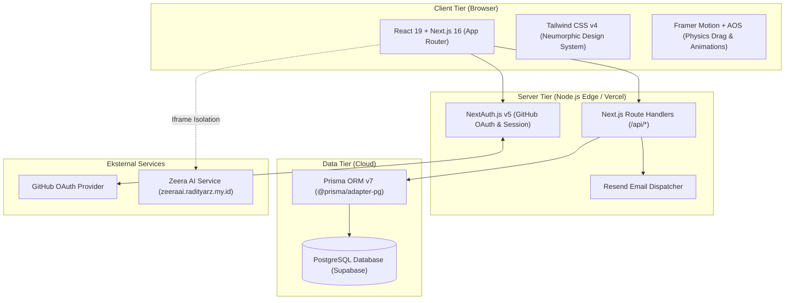
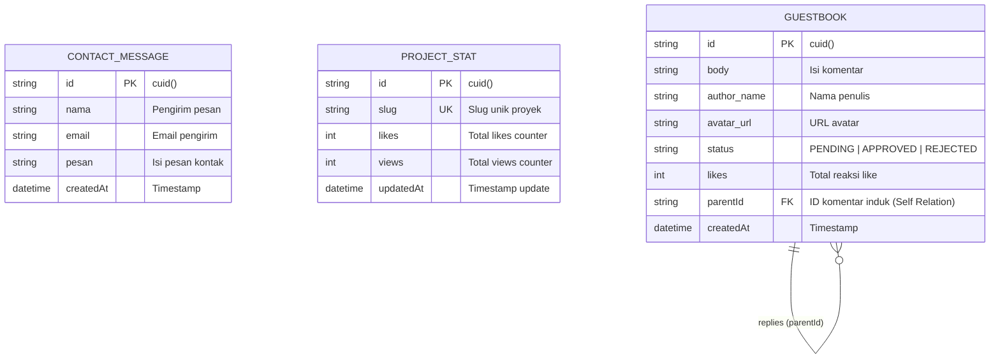

# 📄 PRODUCT REQUIREMENT DOCUMENT (PRD)
# Portfolio Website — Raditya Rai Zeeshan

---

## 📌 1. INFORMASI DOKUMEN & METADATA

| Atribut | Keterangan |
|---|---|
| **Nama Produk** | Raditya Rai Zeeshan Interactive Portfolio & Showcase Platform |
| **Versi Dokumen** | v1.0.0 |
| **Status Dokumen** | Approved / Production Ready |
| **Pemilik Produk (Owner)** | Raditya Rai Zeeshan |
| **Live Production URL** | [radityarz.my.id](https://radityarz.my.id) |
| **Zeera AI Integration** | [zeeraai.radityarz.my.id](https://zeeraai.radityarz.my.id/) |
| **Target Platform** | Web (Desktop, Tablet, Mobile Responsive) |
| **Stack Utama** | Next.js 16 (App Router), React 19, TypeScript, Tailwind CSS v4, Prisma v7, PostgreSQL (Supabase) |

---

## 🎯 2. RINGKASAN EKSEKUTIF (EXECUTIVE SUMMARY)

### 2.1 Latar Belakang
Sebagian besar website portofolio konvensional bersifat statis, kaku, dan hanya berfungsi sebagai brosur digital satu arah. Portofolio seperti ini gagal merefleksikan kapabilitas teknis seorang software engineer modern secara komprehensif.

Sebagai siswa Software and Game Development (PPLG) di SMKN 1 Depok, Full-Stack Developer, dan Founder dari *Z - Project*, **Raditya Rai Zeeshan** membutuhkan sebuah platform digital terpadu yang tidak hanya menampilkan karya secara visual, melainkan membuktikan kompetensi teknis melalui arsitektur aplikasi *real-time full-stack*, sistem autentikasi, moderasi data dinamis, serta pengalaman interaksi tingkat tinggi (*delightful interactive micro-interactions*).

### 2.2 Visi Produk
Membangun platform portofolio interaktif terdepan yang menggabungkan estetika desain **Neumorphism (Soft UI)** dengan arsitektur web modern full-stack berkinerja tinggi, menghadirkan showcase rekayasa perangkat lunak, kepemimpinan, dan layanan profesional yang kredibel, aman, serta interaktif.

### 2.3 Nilai Tambah Utama (Value Propositions)
1. **Full-Stack Proof-of-Work**: Bukan sekadar HTML statis, aplikasi ini menggunakan Next.js App Router, Prisma ORM v7, PostgreSQL database, dan RESTful API terintegrasi.
2. **Sistem Moderasi & Interaksi Komunitas**: Fitur Guestbook publik dengan OAuth GitHub, sistem balasan berantai (*threaded replies*), reaksi like, dan alur kerja moderasi ketat melalui Dashboard Admin khusus.
3. **Integrasi In-App AI (Zeera AI)**: Modal cerdas terisolasi dengan tampilan simulator mobile mockup responsif yang memungkinkan pengunjung berinteraksi dengan AI asisten langsung tanpa keluar dari halaman.
4. **Interaktivitas Fisika Realistis**: Display identitas berupa Nametag Lanyard 3D interaktif yang dapat ditarik (*draggable*) dengan simulasi fisika pegas (*spring physics*).
5. **Estetika Neumorphism Konsisten**: Perpaduan palet warna *Soft Mint/Sage Green* (`#C6E0D2`) dan *Bold Emerald* (`#178358`) dengan sistem bayangan ganda inset/outset yang presisi.

---

## 👥 3. PENGGUNA SASARAN & USER PERSONA

### Persona 1: Tech Recruiter / Hiring Manager
- **Profil**: Perekrut talenta IT dari industri teknologi atau software house.
- **Kebutuhan**: Memverifikasi kompetensi teknis Raditya, mengevaluasi arsitektur kode, meninjau riwayat proyek nyata, dan mengunduh CV resmi.
- **Fitur Utama yang Digunakan**: Hero CTA (Download CV), Featured Projects, Experience & Timeline, Tech Stack Slider.

### Persona 2: Klien Potensial (Z - Project & Freelance)
- **Profil**: Pelajar, mahasiswa, pelaku UMKM, atau profesional yang membutuhkan jasa penulisan akademik, perancangan presentasi interaktif, atau pembuatan website.
- **Kebutuhan**: Melihat portofolio karya, kredibilitas, testimoni klien sebelumnya, dan jalur komunikasi langsung yang cepat.
- **Fitur Utama yang Digunakan**: Testimonial Marquee, Design Corner, Form Kontak, Tombol WhatsApp Langsung.

### Persona 3: Rekan Developer & Pengunjung Komunitas
- **Profil**: Sesama programmer, mahasiswa PPLG, atau penggiat teknologi.
- **Kebutuhan**: Mengeksplorasi antarmuka interaktif, mencoba platform Zeera AI, serta meninggalkan jejak atau pesan apresiasi di buku tamu.
- **Fitur Utama yang Digunakan**: Zeera AI Modal, 3D Draggable Lanyards, Guestbook (Login via GitHub & Like).

### Persona 4: Super Administrator (Raditya Rai Zeeshan)
- **Profil**: Pemilik aplikasi dengan akses terotorisasi email `radityaraizeeshan@gmail.com`.
- **Kebutuhan**: Mengontrol konten publik, memoderasi pesan pending di buku tamu (Approve/Reject), dan memonitor pesan masuk dari form kontak.
- **Fitur Utama yang Digunakan**: Dashboard Moderasi Admin (`/dashraditya`), Notifikasi Email via Resend.

---

## 🗺️ 4. ARSITEKTUR INFORMASI & SITEMAP

```text
[Landing Page (/)]
│
├── 01. Splash Screen Overlay (Initial Loading)
├── 02. Sticky Dual Navigation (Desktop Top Floating Pill / Mobile Bottom Dock)
├── 03. Hero Section (Typewriter, CTA: Hire Me, Download CV, Try Zeera AI)
│    └── [Modal Overlay] Zeera AI Interactive Mobile Simulator
├── 04. Statistics Section (Animated Counters via Intersection Observer)
├── 05. Tech Stack Slider (Infinite Marquee)
├── 06. Experience & Leadership
│    └── 3D Draggable Lanyard Identity Display (Framer Motion)
├── 07. Achievements & Honors (Marching Band & Drum Battle)
├── 08. Featured Projects (Paginated Grid with Tech Tags & Descriptions)
├── 09. Design Corner (Graphic Design Portfolio & Fullscreen Lightbox)
├── 10. About Me & Education Timeline (Interactive Profile & Story)
├── 11. Photography Gallery (Infinite Auto-scroll Showcase)
├── 12. Client Testimonials (Infinite Autoplay Marquee with Hover Pause)
├── 13. Interactive Guestbook (GitHub Auth, Replies, Likes, Pending Notice)
├── 14. Contact Form & Interactive Location Map
└── 15. Footer (Copyright, Quick Links, Social Media)

[Admin Route (/dashraditya)]
└── Protected Guestbook Moderation Dashboard (Filter: All/Main/Replies, Approve/Reject Actions)
```

---

## ⚙️ 5. SPESIFIKASI KEBUTUHAN FUNGSIONAL (FUNCTIONAL REQUIREMENTS)

### 5.1 Modul Splash Screen & Identitas Visual
- **ID Kebutuhan**: `FR-001`
- **Deskripsi**: Tampilan pembuka animasi saat pengguna pertama kali mengakses halaman utama.
- **Spesifikasi**:
  - Menampilkan logo monogram squircle **RRZ** yang berdenyut halus (*pulse animation*).
  - Menampilkan kutipan filosofi hidup: *"It's not the problem that is flawed; fix the mindset, and the problem solves itself."*
  - Dilengkapi *progress indicator* animasi mulus sebelum mentransisikan tampilan ke halaman utama secara otomatis.

### 5.2 Modul Hero Section & Integrasi Interaktif Zeera AI
- **ID Kebutuhan**: `FR-002`
- **Deskripsi**: Bagian utama penarik perhatian (*first-fold view*) dengan identitas personal dan akses cepat ke produk unggulan AI.
- **Spesifikasi**:
  - **Typewriter Dynamic Role**: Efek ketik otomatis bergantian antara peran: *"Fullstack Developer"*, *"UI/UX Designer"*, dan *"Founder of Z - Project"*.
  - **CTA "Hire Me"**: Navigasi *smooth scroll* langsung menuju `#contact`.
  - **CTA "Download CV"**: Tautan dokumen PDF resmi (`/cv/CV - Raditya Rai Zeeshan.pdf`) yang membuka di tab baru.
  - **CTA "Try Zeera AI"**: Membuka popup modal interaktif cerdas tanpa meninggalkan website:
    - **Mobile Mockup Frame**: Tampilan default dengan rasio smartphone (lebar 375px, bezel melengkung, shadow tegas).
    - **Iframe Viewport Isolation**: Memuat antarmuka web [zeeraai.radityarz.my.id](https://zeeraai.radityarz.my.id/) secara terisolasi.
    - **Window Control Bar**:
      - *Minimize*: Mengecilkan modal menjadi *floating pill button* di pojok kanan bawah tanpa me-refresh sesi obrolan.
      - *Maximize / Restore*: Beralih antara ukuran smartphone (375px) dan tampilan desktop layar penuh secara instan.
      - *Open in New Tab*: Membuka link Zeera AI langsung ke browser.
      - *Close*: Menutup modal (dapat ditutup juga menggunakan tombol keyboard `Escape` atau klik pada backdrop).

### 5.3 Modul Statistik Real-Time (Animated Counter)
- **ID Kebutuhan**: `FR-003`
- **Deskripsi**: Penyajian metrik pencapaian dengan animasi angka menghitung (*counter*).
- **Spesifikasi**:
  - Menggunakan *Intersection Observer API* sehingga animasi perhitungan hanya berjalan saat elemen masuk ke dalam viewport pengguna.
  - Metrik yang ditampilkan:
    - **10+** Projects Completed
    - **2+** Years of Learning
    - **5+** Core Technologies
    - **1** Internship Experience

### 5.4 Modul Tech Stack Infinite Marquee
- **ID Kebutuhan**: `FR-004`
- **Deskripsi**: Barisan teknologi dan tools yang berjalan bergulir secara otomatis dan tanpa henti (*infinite marquee*).
- **Spesifikasi**:
  - Kecepatan gulir konstan dan mulus (*linear 25s loop*).
  - Setiap kartu logo memiliki bayangan Neumorphic out, dan beralih ke inset shadow saat dihover.
  - Tooltip nama teknologi muncul saat kursor berada di atas kartu.
  - Daftar stack: Next.js, React, Tailwind CSS, TypeScript, Laravel, Kotlin, Java, PHP, MySQL, Android, Figma, Git, GitHub, VS Code, dll.

### 5.5 Modul Experience & 3D Interactive Draggable Lanyards
- **ID Kebutuhan**: `FR-005`
- **Deskripsi**: Penyajian riwayat kepemimpinan & karier profesional disertai display ID card fisik interaktif.
- **Spesifikasi**:
  - **Timeline Jalur**: Tampilan linimasa bergantian kiri-kanan pada desktop dengan garis konektor dinamis, dan satu garis lurus pada mobile.
  - **Riwayat Pengalaman**:
    1. *Founder & Project Manager* — Z - Project (2024 - Sekarang)
    2. *Assistant Coach & Head of Equipment* — Al-Hidayah Marching Band (2024 - 2025)
    3. *FullStack Developer (Internship)* — Indi Technology
  - **3D Physics Draggable Lanyards**:
    - Dua kartu identitas fisik: ID Card Indi Technology (Lanyard Biru) dan ID Card Al-Hidayah (Lanyard Marun).
    - Digerakkan dengan **Framer Motion** (`drag={true}`, `dragElastic={0.4}`).
    - Tali lanyard meregang secara proporsional (*scaleY* mengikuti nilai *dragY* kartu).
    - Klip pengait logam bergerak vertikal mengikuti tarikan kartu.
    - Kartu memantul kembali ke posisi semula secara elastis saat dilepaskan.

### 5.6 Modul Achievements & Rekam Jejak Prestasi
- **ID Kebutuhan**: `FR-006`
- **Deskripsi**: Galeri pencapaian resmi dalam kejuaraan Marching Band & Drum Battle.
- **Spesifikasi**:
  - Kartu bergaya Neumorphic dengan ikon piala (`Trophy`).
  - Menampilkan judul juara, nama ajang kejuaraan, peran (Snare Player / Asisten Pelatih), dan tahun kompetisi (2023 - 2025).

### 5.7 Modul Featured Projects & Paginasi Dinamis
- **ID Kebutuhan**: `FR-007`
- **Deskripsi**: Showcase portofolio aplikasi web, mobile, dan permodelan 3D.
- **Spesifikasi**:
  - Sistem grid responsif (1 kolom mobile, 2 kolom tablet, 3 kolom desktop).
  - Setiap kartu memuat: Thumbnail gambar teroptimasi, Judul Proyek, Deskripsi Fungsional, dan Badge Tag Teknologi.
  - Sistem paginasi dinamis (6 item per halaman) dengan tombol navigasi *Previous* & *Next*.
  - *Smooth scroll back to top of projects* saat berganti halaman.
  - API pendukung analitik likes dan views per proyek (`/api/projects/stats`).

### 5.8 Modul Design Corner & Fullscreen Lightbox
- **ID Kebutuhan**: `FR-008`
- **Deskripsi**: Galeri hasil karya desain grafis, ilustrasi perayaan hari nasional, jersey, dan stiker komunitas.
- **Spesifikasi**:
  - Grid paginasi karya desain berbasis Canva & grafis vektor.
  - Modal **Fullscreen Lightbox**: Mengklik karya desain akan membuka pratinjau resolusi tinggi layar penuh dengan latar belakang gelap, tombol navigasi, dan tombol tutup.

### 5.9 Modul About Me & Linimasa Edukasi
- **ID Kebutuhan**: `FR-009`
- **Deskripsi**: Informasi biografi mendalam, visi hidup, serta riwayat pendidikan formal.
- **Spesifikasi**:
  - Kartu foto profil Neumorphic dengan efek interaktif *grayscale-to-color transition* saat kursor diarahkan ke foto.
  - Narasi biografi personal dan kutipan filosofi hidup.
  - Linimasa pendidikan berurutan:
    - *2024 - Sekarang*: SMKN 1 Depok (Pengembangan Perangkat Lunak dan Gim)
    - *2021 - 2024*: MTs Alhidayah Sukatani
    - *2015 - 2021*: SDN Sukatani 7

### 5.10 Modul Photography Gallery & Testimonials Marquee
- **ID Kebutuhan**: `FR-010`
- **Deskripsi**: Dokumentasi aktivitas nyata dan ulasan kepuasan dari klien *Z - Project* serta mentor industri.
- **Spesifikasi**:
  - **Gallery Slider**: Menggunakan static image import Next.js untuk mempertahankan aspek rasio asli (portrait/landscape) dengan animasi gulir tanpa henti.
  - **Testimonial Slider**: Kartu kutipan testimoni klien asli dengan efek auto-scroll kontinu dan fungsi *pause on hover/touch*.

### 5.11 Modul Buku Tamu Interaktif (Community Guestbook)
- **ID Kebutuhan**: `FR-011`
- **Deskripsi**: Fitur interaksi komunitas tempat pengunjung dapat meninggalkan pesan, membalas komentar, dan memberikan reaksi suka.
- **Spesifikasi**:
  - **Autentikasi Ganda**:
    - Login via **GitHub OAuth** menggunakan NextAuth.js v5 (mengambil nama dan avatar otomatis).
    - Opsi kirim pesan sebagai **Anonymous** tanpa perlu login.
  - **Struktur Komentar Bertingkat (Threaded Replies)**: Pengguna dapat membalas komentar utama secara langsung (`parentId`).
  - **Reaksi Like**: Fitur peningkatan like secara real-time melalui endpoint `PATCH /api/guestbook/like`.
  - **Sistem Moderasi Wajib (Pending Workflow)**: Setiap pesan baru yang dikirimkan secara otomatis berstatus `PENDING` dan tidak akan ditampilkan ke publik sebelum disetujui oleh admin.
  - **Paginasi Komentar**: Menampilkan 3 komentar utama per halaman dengan navigasi halaman yang bersih.
  - **Validasi Input**: Panjang pesan minimal 3 karakter, maksimal 500 karakter.

### 5.12 Modul Dashboard Moderasi Admin (`/dashraditya`)
- **ID Kebutuhan**: `FR-012`
- **Deskripsi**: Halaman khusus manajemen dan moderasi pesan buku tamu.
- **Spesifikasi**:
  - **Proteksi Akses Ketat (RBAC)**: Hanya pengguna dengan sesi login email `radityaraizeeshan@gmail.com` yang dapat mengakses halaman dan API endpoint ini. Pengguna tidak terotorisasi akan dialihkan ke halaman utama.
  - **Filter Pesan**: Kemampuan menyortir daftar pesan pending: *Semua Pesan*, *Komentar Utama*, atau *Balasan*.
  - **Aksi Moderasi**:
    - Tombol **Approve**: Mengubah status menjadi `APPROVED` agar pesan tampil di publik.
    - Tombol **Decline / Reject**: Mengubah status menjadi `REJECTED` untuk menolak spam atau konten tidak pantas.
  - **Notifikasi Toast**: Memberikan respon visual instan atas setiap aksi moderasi yang berhasil.

### 5.13 Modul Formulir Kontak & Integrasi Email
- **ID Kebutuhan**: `FR-013`
- **Deskripsi**: Kanal komunikasi resmi bagi perekrut atau klien untuk mengirimkan pesan langsung kepada Raditya.
- **Spesifikasi**:
  - **Validasi Formulir**: Nama (min. 2 karakter), Email (format regex email valid), Pesan (min. 10 karakter).
  - **Penyimpanan Database**: Pesan otomatis tersimpan secara permanen ke tabel `ContactMessage` PostgreSQL via Prisma.
  - **Notifikasi Email Transaksional**: Sistem secara otomatis mengirimkan email notifikasi berformat HTML modern ke kotak masuk Raditya menggunakan **Resend API**.
  - **Non-blocking Email Delivery**: Kegagalan pada pihak ketiga pengiriman email tidak membatalkan penyimpanan pesan ke database.
  - **Google Maps & WhatsApp Direct**: Peta interaktif SMKN 1 Depok / Depok area serta tautan langsung ke WhatsApp `+6281946315326`.

### 5.14 Modul Navigasi Adaptif Ganda
- **ID Kebutuhan**: `FR-014`
- **Deskripsi**: Sistem navigasi responsif yang dioptimalkan khusus untuk desktop dan perangkat genggam.
- **Spesifikasi**:
  - **Desktop Navigation**: *Floating pill navbar* di bagian atas layar dengan efek Neumorphic, logo monogram, serta penanda aktif dinamis berbasis *spring motion*.
  - **Mobile Dock Navigation**: *Ergonomic bottom navigation bar* tetap di bagian bawah layar smartphone untuk navigasi satu tangan (*thumb zone friendly*).
  - **Active ScrollSpy**: Otomatis mendeteksi section mana yang sedang aktif saat pengguna melakukan *scrolling*.

---

## 🔒 6. KEBUTUHAN NON-FUNGSIONAL (NON-FUNCTIONAL REQUIREMENTS)

### 6.1 Performa & Core Web Vitals
- **LCP (Largest Contentful Paint)**: < 2.0 detik pada koneksi 4G standar.
- **CLS (Cumulative Layout Shift)**: < 0.05 dengan reservasi dimensi gambar menggunakan komponen `next/image`.
- **FID / INP (Interaction to Next Paint)**: < 100 milidetik untuk memastikan animasi tombol dan micro-interaction responsif seketika.
- **Optimalisasi Aset**: Seluruh gambar static dikonversi dan dikompresi ke format WebP/AVIF modern.

### 6.2 Keamanan Data & Otorisasi
- **Autentikasi Aman**: Menggunakan NextAuth.js v5 Beta dengan proteksi token CSRF bawaan.
- **Role-Based Access Control**: Pembatasan mutlak endpoint `/api/admin/*` berbasis verifikasi sesi email admin.
- **Sanitisasi Input**: Seluruh payload teks pada formulir kontak dan buku tamu dibersihkan dari whitespace dan tag berbahaya sebelum masuk ke query ORM untuk mencegah serangan SQL Injection dan XSS.
- **Secret Key Protection**: Seluruh kredensial sensitif (`AUTH_SECRET`, `GITHUB_ID`, `GITHUB_SECRET`, `DATABASE_URL`, `RESEND_API_KEY`) wajib dienkripsi dalam *environment variables* dan tidak boleh terpapar di sisi klien.

### 6.3 Kompatibilitas Perangkat & Browser
- Mendukung peramban modern: Google Chrome, Mozilla Firefox, Apple Safari, Microsoft Edge versi terbaru.
- Mendukung variasi resolusi:
  - Mobile: 360px – 480px
  - Tablet: 768px – 1024px
  - Desktop: 1280px – 1920px+

### 6.4 Sistem Desain Neumorphism (Soft UI Specification)
Sistem visual wajib mematuhi panduan desain Neumorphic berbasis variabel CSS token:
- **Surface Color**: `#C6E0D2` (Soft Mint / Sage Green)
- **Primary Text Color**: `#284435` (Dark Pine Green)
- **Accent Color**: `#178358` (Bold Emerald)
- **Outset Shadow (Timbul/Convex)**: `10px 10px 20px rgba(150, 175, 161, 0.7), -10px -10px 20px rgba(255, 255, 255, 0.9)`
- **Inset Shadow (Cekung/Concave)**: `inset 10px 10px 20px rgba(150, 175, 161, 0.7), inset -10px -10px 20px rgba(255, 255, 255, 0.9)`
- **Tipografi**:
  - *Headings*: `Poppins` (Weights: 600, 700, 800, 900)
  - *Body Text*: `Inter` (Weights: 400, 500, 600)

### 6.5 Perlindungan Hak Cipta & Lisensi
- Repositori dan materi di dalamnya bersifat *Proprietary / All Rights Reserved*.
- Dilarang keras melakukan kloning (*git clone*), re-upload, atau plagiasi kode dan aset identitas pribadi tanpa izin tertulis dari Raditya Rai Zeeshan.

---

## 🏛️ 7. ARSITEKTUR TEKNOLOGI & SKEMA DATA

### 7.1 Tech Stack Matrix



### 7.2 Skema Entitas Basis Data (Entity Relationship)



#### Definisi Model Prisma (`prisma/schema.prisma`):
```prisma
// Tabel 1: Pesan dari Form Kontak
model ContactMessage {
  id        String   @id @default(cuid())
  nama      String
  email     String
  pesan     String
  createdAt DateTime @default(now())
}

// Tabel 2: Like & View Counter per Project
model ProjectStat {
  id        String   @id @default(cuid())
  slug      String   @unique
  likes     Int      @default(0)
  views     Int      @default(0)
  updatedAt DateTime @updatedAt
}

// Tabel 3: Buku Tamu (Guestbook) dengan Moderasi & Threading
model Guestbook {
  id          String      @id @default(cuid())
  body        String
  author_name String      @default("Anonymous")
  avatar_url  String?
  status      String      @default("PENDING") // PENDING | APPROVED | REJECTED
  likes       Int         @default(0)
  parentId    String?
  parent      Guestbook?  @relation("GuestbookReplies", fields: [parentId], references: [id])
  replies     Guestbook[] @relation("GuestbookReplies")
  createdAt   DateTime    @default(now())
}
```

---

## 📡 8. DOKUMENTASI SPESIFIKASI API (API CONTRACTS)

### 8.1 Public Guestbook API
- **Endpoint**: `GET /api/guestbook`
  - **Akses**: Publik
  - **Fungsi**: Mengambil seluruh komentar level teratas (`parentId: null`) yang berstatus `APPROVED` beserta balasan yang juga disetujui.
  - **Response (200 OK)**:
    ```json
    [
      {
        "id": "cm7...",
        "body": "Website portofolionya keren banget!",
        "author_name": "John Doe",
        "avatar_url": "https://avatars.githubusercontent.com/...",
        "likes": 5,
        "createdAt": "2026-03-01T10:00:00.000Z",
        "replies": [
          {
            "id": "cm7...sub",
            "body": "Terima kasih banyak!",
            "author_name": "Raditya Rai Zeeshan",
            "avatar_url": "...",
            "likes": 2,
            "createdAt": "2026-03-01T11:00:00.000Z"
          }
        ]
      }
    ]
    ```

- **Endpoint**: `POST /api/guestbook`
  - **Akses**: Publik (Pengguna login GitHub / Anonim)
  - **Fungsi**: Mengirimkan komentar baru atau balasan. Otomatis masuk status `PENDING`.
  - **Request Body**:
    ```json
    {
      "body": "Pesan komentar di sini...",
      "parentId": "optional-parent-id-jika-membalas"
    }
    ```
  - **Response (201 Created)**: `{"success": true, "id": "cm7..."}`

- **Endpoint**: `PATCH /api/guestbook/like`
  - **Akses**: Publik
  - **Request Body**: `{"id": "cm7..."}`
  - **Response (200 OK)**: `{"success": true, "likes": 6}`

### 8.2 Admin Guestbook Moderation API
- **Endpoint**: `GET /api/admin/guestbook`
  - **Akses**: Restricted (Hanya Admin `radityaraizeeshan@gmail.com`)
  - **Fungsi**: Mengambil seluruh pesan dengan status `PENDING`.
  - **Response (200 OK)**: Array pesan pending beserta data induk komentar.
  - **Response (401 Unauthorized)**: Jika sesi bukan admin.

- **Endpoint**: `PATCH /api/admin/guestbook`
  - **Akses**: Restricted (Hanya Admin)
  - **Request Body**:
    ```json
    {
      "id": "cm7...",
      "status": "APPROVED" // Atau "REJECTED"
    }
    ```
  - **Response (200 OK)**: `{"success": true, "message": { ... }}`

### 8.3 Contact & Notification API
- **Endpoint**: `POST /api/contact`
  - **Akses**: Publik
  - **Fungsi**: Menyimpan pesan kontak ke basis data dan mengirimkan notifikasi email via Resend.
  - **Request Body**:
    ```json
    {
      "nama": "Budi Santoso",
      "email": "budi@example.com",
      "pesan": "Halo Raditya, saya tertarik berdiskusi proyek..."
    }
    ```
  - **Response (201 Created)**: `{"success": true, "id": "cm7..."}`
  - **Response (400 Bad Request)**: Jika validasi field gagal.

### 8.4 Project Statistics API
- **Endpoint**: `GET /api/projects/stats?slug={slug}`
  - **Akses**: Publik
  - **Response (200 OK)**: `{"slug": "zeera-ai", "likes": 12, "views": 140}`

- **Endpoint**: `POST /api/projects/stats`
  - **Akses**: Publik
  - **Request Body**: `{"slug": "zeera-ai", "action": "like"}` *(atau action: "view")*
  - **Response (200 OK)**: `{"slug": "zeera-ai", "likes": 13, "views": 140}`

---

## 🚀 9. RENCANA PENGEMBANGAN & ROADMAP MASA DEPAN

| Fase | Inisiatif | Estimasi Target | Deskripsi |
|---|---|---|---|
| **Fase 1 (Selesai)** | Core Full-Stack Launch | Q1 2026 | Rilis portofolio Neumorphic, integrasi Zeera AI, 3D Lanyard, Guestbook, Admin Moderation, Resend API. |
| **Fase 2 (Berikutnya)** | Dynamic Headless CMS | Q2 2026 | Membangun dashboard manajemen proyek dan sertifikat mandiri tanpa perlu hardcoded file code. |
| **Fase 3** | AI Automated Spam Filter | Q3 2026 | Integrasi natural language classification untuk otomatis menandai spam atau komentar tidak pantas pada Guestbook. |
| **Fase 4** | Theme Switcher (Dark Neumorphism) | Q4 2026 | Menghadirkan opsi tema *Dark Neumorphism* (Charcoal/Obsidian Glow) bagi pengunjung yang menyukai mode gelap. |

---

## 📝 10. KESIMPULAN & TANDA TANGAN PERSETUJUAN

Dokumen Kebutuhan Produk (PRD) ini merangkum secara utuh standar fungsional, arsitektural, dan visual dari platform portofolio Raditya Rai Zeeshan. Dokumen ini menjadi acuan tunggal (*single source of truth*) dalam pemeliharaan sistem, pengembangan fitur lanjutan, serta pembuktian kelaikan teknis proyek.

**Disusun & Disahkan oleh:**

**Raditya Rai Zeeshan**  
*Full-Stack Web Developer & Founder of Z - Project*  
Depok, Jawa Barat, Indonesia  
Kontak: [radityaraizeeshan@gmail.com](mailto:radityaraizeeshan@gmail.com) | [+62 819 4631 5326](https://wa.me/6281946315326)
