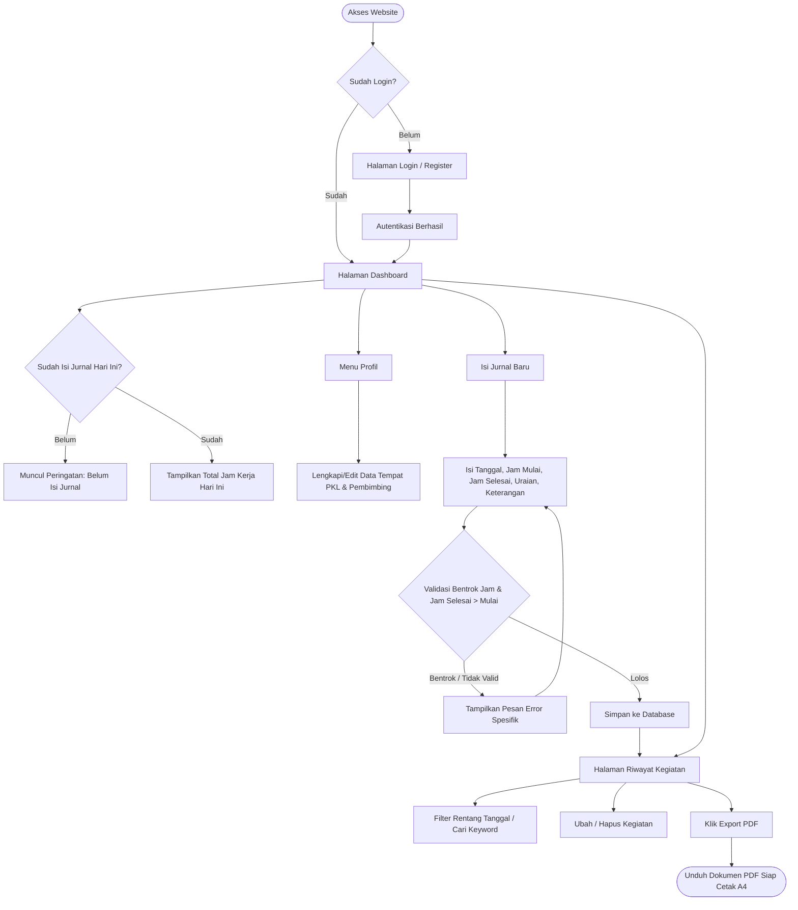
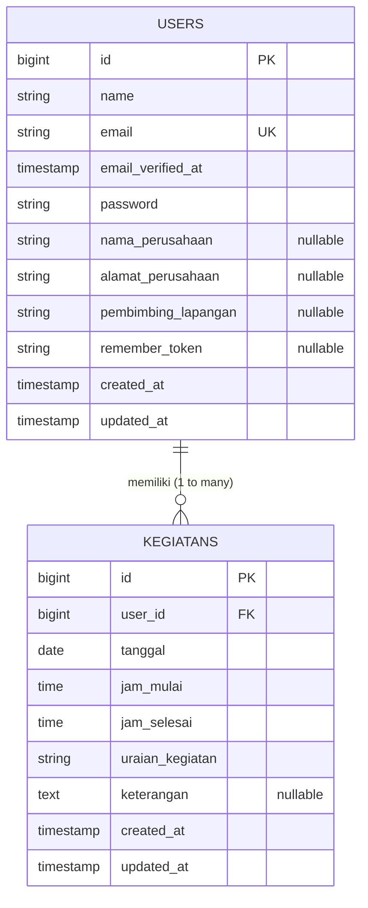

# Product Requirement Document (PRD)
# Sistem Informasi Jurnal Praktik Kerja Lapangan (Web Jurnal PKL)

---

| Atribut Dokumen | Informasi |
| :--- | :--- |
| **Nama Produk** | Web Jurnal PKL (Aplikasi Pencatatan Kegiatan Harian Siswa/Mahasiswa PKL) |
| **Versi Dokumen** | 1.0.0 |
| **Status Dokumen** | Approved / Production-Ready |
| **Teknologi Utama** | Laravel 13, PHP 8.3+, Tailwind CSS, Alpine.js, DomPDF, SQLite/MySQL |
| **Target Pengguna** | Siswa SMK, Mahasiswa Magang/PKL, Pembimbing Lapangan, Guru/Dosen Pembimbing |

---

## 1. Ringkasan Eksekutif (Executive Summary)

Sistem Informasi **Jurnal PKL** adalah aplikasi berbasis web yang dirancang untuk mendigitalkan, menyederhanakan, dan memvalidasi proses pencatatan aktivitas harian peserta Praktik Kerja Lapangan (PKL) / magang industri. 

Sistem ini menggantikan pencatatan jurnal berbasis kertas atau spreadsheet manual yang rawan hilang, manipulasi waktu, dan merepotkan saat rekapitulasi akhir periode. Dilengkapi dengan arsitektur multi-user yang terisolasi aman, validasi anti-bentrok jam kerja, pemantau pemenuhan target jam kerja harian (8 jam), serta generator laporan otomatis berformat PDF standar cetak A4.

---

## 2. Latar Belakang & Pernyataan Masalah (Problem Statement)

### 2.1 Latar Belakang
Setiap instansi pendidikan (SMK/Politeknik/Universitas) mewajibkan siswa/mahasiswa melakukan PKL dan melaporkan aktivitas harian sebagai bukti kinerja serta syarat kelulusan. Laporan ini biasanya mencakup uraian tugas, durasi pengerjaan, instansi tempat magang, dan tanda tangan pembimbing lapangan.

### 2.2 Masalah yang Dihadapi
1. **Pencatatan Konvensional yang Rentan**: Buku jurnal manual sering kotor, hilang, atau baru diisi secara borongan di akhir periode magang (tidak akuntabel).
2. **Tabrakan Jadwal Kerja (Time Overlapping)**: Pengisian jam kegiatan secara manual seringkali memicu bentrok jam mulai dan jam selesai dalam satu hari yang sama tanpa disadari.
3. **Ketiadaan Indikator Beban Kerja Harian**: Peserta PKL kesulitan memantau apakah mereka telah memenuhi standar jam kerja harian normal (umumnya 8 jam/hari).
4. **Beban Rekapitulasi Laporan Akhir**: Menyusun kembali ratusan log aktivitas ke dalam laporan formal siap cetak membutuhkan waktu lama dan formatnya sering tidak seragam.

---

## 3. Visi Produk & Target Keberhasilan (Product Goals & KPIs)

### 3.1 Visi Produk
Menjadi platform pencatatan aktivitas harian PKL yang modern, cepat, akurat, dan dapat diakses dengan mudah dari perangkat desktop maupun smartphone melalui antarmuka *glassmorphism* yang bersih.

### 3.2 Key Performance Indicators (KPIs)
- **Zero Time Collision**: 100% data log kegiatan harian tidak memiliki irisan jam yang bertabrakan berkat validasi lapis aplikasi.
- **Efisiensi Pembuatan Laporan**: Pembuatan laporan kegiatan berformat PDF lengkap dengan profil instansi dapat diselesaikan dalam 1 klik (< 3 detik).
- **Integritas & Privasi Data**: 100% data kegiatan terisolasi antar pengguna (*zero data leakage* antar siswa/mahasiswa).
- **Akurasi Monitoring**: Peserta mendapatkan visibilitas langsung terhadap status pengisian jurnal hari ini dan akumulasi total jam kerja harian.

---

## 4. Analisis Pengguna & Persona (Target Audience & Personas)

### 4.1 Persona Utama: Peserta PKL (Siswa / Mahasiswa)
- **Profil**: Siswa SMK tingkat akhir atau mahasiswa magang yang menjalani kegiatan di dunia usaha/industri.
- **Karakteristik**: Mengakses sistem melalui ponsel pintar saat di kantor atau laptop di rumah.
- **Kebutuhan**:
  - Mencatat kegiatan dengan cepat segera setelah pekerjaan selesai.
  - Memastikan jam kegiatan tidak tumpang tindih.
  - Melihat akumulasi jam kerja hari ini agar tahu apakah sudah mencapai 8 jam.
  - Mengunduh rekap jurnal dalam format PDF rapi untuk ditandatangani pembimbing.

### 4.2 Persona Sekunder: Pembimbing Lapangan / Instansi & Guru/Dosen Pembimbing
- **Profil**: Supervisor di perusahaan atau guru/dosen monitor di sekolah/kampus.
- **Kebutuhan**:
  - Menerima lembar laporan cetak PDF terstruktur yang memuat identitas instansi, nama pembimbing, tanggal, rentang jam kerja presisi, dan uraian tugas.

---

## 5. Arsitektur Alur Pengguna (User Flow & Journey)



---

## 6. Spesifikasi Kebutuhan Fungsional (Functional Requirements)

### FR-01: Modul Autentikasi & Pengelolaan Akun
- **FR-01.1 (Registrasi)**: Calon pengguna dapat mendaftarkan akun baru menggunakan Nama Lengkap, Alamat Email yang unik, dan Kata Sandi terenkripsi.
- **FR-01.2 (Login & Logout)**: Pengguna dapat masuk menggunakan email dan password, serta keluar (logout) dengan aman dan regenerasi session token.
- **FR-01.3 (Reset Password)**: Pengguna dapat meminta tautan reset password via email jika lupa kata sandi.
- **FR-01.4 (Pembaruan Akun)**: Pengguna dapat mengganti nama profil, email, serta mengganti kata sandi lama dengan kata sandi baru.
- **FR-01.5 (Penghapusan Akun)**: Pengguna dapat menghapus akunnya sendiri dengan konfirmasi kata sandi saat ini. Seluruh data kegiatan yang berelasi otomatis terhapus (*cascade on delete*).

### FR-02: Modul Kelengkapan Data Profil PKL
- **FR-02.1 (Input Data Tempat PKL)**: Pengguna dapat menginput dan memperbarui atribut spesifik PKL:
  - Nama Perusahaan / Instansi
  - Alamat Perusahaan
  - Nama Pembimbing Lapangan
- **FR-02.2 (Sinkronisasi Otomatis ke Laporan)**: Seluruh data tempat PKL dan pembimbing otomatis menjadi *header metadata* pada dokumen ekspor PDF.

### FR-03: Modul Dashboard Cerdas & Monitoring Harian
- **FR-03.1 (Status Kehadiran/Jurnal Hari Ini)**:
  - Jika belum ada data kegiatan di tanggal berjalan: Menampilkan *banner warning* "Kamu belum isi jurnal hari ini" beserta tautan cepat ke formulir input.
  - Jika sudah mengisi: Menampilkan *banner success* beserta total kalkulasi waktu kerja (Format: `X jam Y menit`).
  - Menampilkan catatan peringatan khusus jika total jam kerja hari ini masih di bawah 8 jam (< 480 menit).
- **FR-03.2 (Ringkasan Statistik)**: Menampilkan total seluruh kegiatan yang telah tercatat oleh pengguna.
- **FR-03.3 (Daftar Kegiatan Terkini)**: Menampilkan 5 kegiatan terakhir yang diurutkan berdasarkan tanggal terbaru dan jam mulai terbaru.
- **FR-03.4 (Akses Cepat)**: Tombol *call-to-action* langsung ke formulir tambah kegiatan dan daftar riwayat lengkap.

### FR-04: Modul Manajemen Kegiatan Jurnal (CRUD)
- **FR-04.1 (Tambah Kegiatan)**:
  - Form input menyediakan field: `tanggal` (default hari ini), `jam_mulai`, `jam_selesai`, `uraian_kegiatan` (wajib, max 255 karakter), dan `keterangan` (opsional).
- **FR-04.2 (Edit Kegiatan)**: Pengguna dapat mengubah rincian kegiatan yang sebelumnya telah diinput.
- **FR-04.3 (Hapus Kegiatan)**: Pengguna dapat menghapus rekaman kegiatan dengan dialog konfirmasi persetujuan dari peramban (*browser confirm*).
- **FR-04.4 (Otorisasi Akses Ketat)**: Setiap akses terhadap data kegiatan divalidasi kepemilikannya. Jika pengguna mencoba mengakses ID kegiatan milik akun lain, sistem menolak dengan kode respons HTTP `403 Forbidden`.

### FR-05: Modul Validasi Anti-Bentrok Waktu (Time Collision Engine)
- **FR-05.1 (Validasi Kronologis)**: `jam_selesai` wajib lebih akhir daripada `jam_mulai` (`after:jam_mulai`).
- **FR-05.2 (Validasi Tumpang Tindih / Overlap)**:
  - Sistem memeriksa basis data pada pengguna yang sama dan tanggal yang sama.
  - Rumus bentrok: 
    $$\text{Jam Mulai Baru} < \text{Jam Selesai Lama} \quad \text{DAN} \quad \text{Jam Selesai Baru} > \text{Jam Mulai Lama}$$
  - Jika irisan waktu terdeteksi, penyimpanan ditolak dengan pesan error: *"Jam ini bentrok dengan kegiatan lain yang sudah kamu catat di tanggal yang sama."*
  - Pada proses pembaruan (Edit), validasi mengecualikan ID rekaman yang sedang disunting (`ignoreId`).

### FR-06: Modul Riwayat, Pencarian, & Filter
- **FR-06.1 (Filter Berdasarkan Tanggal)**: Pengguna dapat menyaring kegiatan berdasarkan rentang tanggal: `Dari Tanggal` dan `Sampai Tanggal`.
- **FR-06.2 (Pencarian Kata Kunci)**: Pengguna dapat mencari data berdasarkan kemunculan kata pada `uraian_kegiatan` menggunakan klausa pencarian *wildcard*.
- **FR-06.3 (Reset Filter)**: Terdapat tombol reset interaktif yang muncul otomatis saat parameter filter terisi untuk mengembalikan tampilan ke seluruh data.
- **FR-06.4 (Paginasi)**: Data disajikan secara terpotong per 10 baris per halaman, dengan URL query string yang tetap terjaga saat navigasi halaman (*preserving query string*).

### FR-07: Modul Ekspor Laporan PDF
- **FR-07.1 (Format Standar A4 Portrait)**: Menghasilkan dokumen cetak berstandar lembar kerja formal.
- **FR-07.2 (Struktur Isi Laporan)**:
  - Judul Dokumen: "Laporan Kegiatan PKL".
  - Informasi Identitas: Nama Pengguna, Nama Instansi, Alamat Instansi, Nama Pembimbing Lapangan.
  - Stempel Waktu: Tanggal dan jam pencetakan dokumen.
  - Tabel Rekapitulasi: Kolom Tanggal, Rentang Jam, Uraian Kegiatan, dan Keterangan.
  - Pengurutan Data: Kronologis menaik (tanggal terlama ke terbaru, lalu jam mulai terlama ke terbaru) untuk kebutuhan arsip resmi.

---

## 7. Spesifikasi Kebutuhan Non-Fungsional (Non-Functional Requirements)

### 7.1 Keamanan & Privasi (Security)
- **Autentikasi Aman**: Perlindungan terhadap *brute-force* menggunakan *rate limiting* bawaan Laravel.
- **Hashing Kata Sandi**: Sandi akun disimpan dalam bentuk hash aman menggunakan algoritma Bcrypt / Argon2ID.
- **Proteksi CSRF**: Seluruh formulir perubahan status (POST, PUT/PATCH, DELETE) dilindungi *Cross-Site Request Forgery token*.
- **Isolasi Data Multitenansi**: Query data kegiatan selalu disaring secara terprogram berdasarkan `auth()->id()`.

### 7.2 Performa & Kecepatan (Performance)
- **Waktu Muat Halaman**: Halaman dashboard dan riwayat dimuat dalam waktu < 1 detik pada koneksi internet standar.
- **Generasi PDF Cepat**: Kompilasi template HTML Blade ke dokumen PDF oleh DomPDF memakan waktu rata-rata < 2.5 detik untuk 500 baris data.
- **Optimasi Aset**: Aset JavaScript dan CSS dikompilasi serta diminifikasi menggunakan Vite.

### 7.3 Desain Antarmuka & Responsivitas (UI/UX)
- **Tema Desain**: Mengusung estetika *Modern Glassmorphism* (kartu transparan dengan efek `backdrop-blur`, gradasi latar belakang lembut, dan aksen warna biru/indigo).
- **Responsivitas**: Desain adaptif dari layar smartphone (lebar minimal 360px), tablet, hingga layar desktop Full HD.
- **Navigasi Seluler**: Menyediakan menu drawer hamburger mobile berbasis Alpine.js yang ringan tanpa dependensi pustaka eksternal yang berat.

### 7.4 Skalabilitas & Kompatibilitas Basis Data
- Mendukung basis data *zero-config* bawaan SQLite untuk pengujian cepat dan lingkungan lokal.
- Sepenuhnya kompatibel dengan MySQL/MariaDB (Laragon, XAMPP, VPS Linux) untuk implementasi skala produksi hanya dengan mengubah konfigurasi `.env`.

---

## 8. Desain Basis Data & Kamus Data (Data Dictionary)

### 8.1 Entity Relationship Diagram (ERD)



### 8.2 Kamus Data (Data Dictionary)

#### A. Tabel `users`
Menyimpan kredensial otentikasi serta profil instansi tempat PKL.

| Nama Kolom | Tipe Data | Keterangan / Atribut | Deskripsi |
| :--- | :--- | :--- | :--- |
| `id` | BIGINT UNSIGNED | Primary Key, Auto Increment | ID unik pengguna |
| `name` | VARCHAR(255) | NOT NULL | Nama lengkap peserta PKL |
| `email` | VARCHAR(255) | NOT NULL, UNIQUE | Alamat email untuk login |
| `email_verified_at`| TIMESTAMP | NULLABLE | Waktu verifikasi email |
| `password` | VARCHAR(255) | NOT NULL | Hash kata sandi |
| `nama_perusahaan` | VARCHAR(255) | NULLABLE | Nama perusahaan / instansi tempat PKL |
| `alamat_perusahaan`| VARCHAR(255) | NULLABLE | Alamat fisik kantor/instansi |
| `pembimbing_lapangan`| VARCHAR(255)| NULLABLE | Nama supervisor/pembimbing lapangan |
| `remember_token` | VARCHAR(100) | NULLABLE | Token sesi login "remember me" |
| `created_at` | TIMESTAMP | NULLABLE | Waktu pendaftaran akun |
| `updated_at` | TIMESTAMP | NULLABLE | Waktu pembaruan profil akun |

#### B. Tabel `kegiatans`
Menyimpan setiap rekaman aktivitas harian yang dilakukan pengguna selama PKL.

| Nama Kolom | Tipe Data | Keterangan / Atribut | Deskripsi |
| :--- | :--- | :--- | :--- |
| `id` | BIGINT UNSIGNED | Primary Key, Auto Increment | ID unik rekaman kegiatan |
| `user_id` | BIGINT UNSIGNED | Foreign Key, NOT NULL, Cascade | Relasi ke `users.id` (dihapus jika user dihapus) |
| `tanggal` | DATE | NOT NULL | Tanggal pelaksanaan kegiatan |
| `jam_mulai` | TIME | NOT NULL | Waktu mulai kegiatan (HH:MM:SS) |
| `jam_selesai` | TIME | NOT NULL | Waktu selesai kegiatan (HH:MM:SS) |
| `uraian_kegiatan`| VARCHAR(255) | NOT NULL | Rangkuman tugas atau pekerjaan yang dilakukan |
| `keterangan` | TEXT | NULLABLE | Catatan tambahan, kendala, atau hasil tugas |
| `created_at` | TIMESTAMP | NULLABLE | Waktu data dibuat |
| `updated_at` | TIMESTAMP | NULLABLE | Waktu data terakhir disunting |

---

## 9. Struktur Navigasi & Peta Situs (Information Architecture)

```
├── / (Root) ──> Redirect otomatis ke /login
├── [Guest Routes]
│   ├── /login (Halaman masuk akun)
│   ├── /register (Halaman pendaftaran akun)
│   ├── /forgot-password (Lupa kata sandi)
│   └── /reset-password (Setel ulang kata sandi)
└── [Authenticated Routes] (Wajib Login)
    ├── /dashboard (Dashboard statistik, pengingat harian, jam kerja, 5 kegiatan terbaru)
    ├── /kegiatan (Daftar riwayat kegiatan dengan filter tanggal, pencarian, & paginasi)
    │   ├── /kegiatan/create (Formulir tambah catatan kegiatan)
    │   ├── /kegiatan/{id}/edit (Formulir ubah kegiatan)
    │   └── /kegiatan-export/pdf (Unduh laporan PDF)
    └── /profile (Pengaturan profil pengguna, ubah password, info tempat PKL, hapus akun)
```

---

## 10. Spesifikasi Teknis & Lingkungan Pengembangan (Technical Specs)

### 10.1 Stack Teknologi
- **Bahasa Pemrograman**: PHP 8.3+
- **Web Framework**: Laravel 13 (Arsitektur MVC)
- **Autentikasi**: Laravel Breeze (Blade Variant)
- **Frontend & Styling**: 
  - Tailwind CSS 3.x (Glassmorphism UI Preset)
  - Alpine.js (State Management Navbar & Komponen Interaktif)
  - Vite (Build Tool & Hot Module Replacement)
- **Generator Dokumen**: `barryvdh/laravel-dompdf` (v3.1+)
- **Basis Data**:
  - Development / Default: SQLite (`database/database.sqlite`)
  - Production Option: MySQL / MariaDB

### 10.2 Dependensi Kunci (`composer.json`)
```json
{
    "require": {
        "php": "^8.3",
        "barryvdh/laravel-dompdf": "^3.1",
        "laravel/framework": "^13.8",
        "laravel/tinker": "^3.0"
    }
}
```

---

## 11. Aturan Bisnis (Business Rules)

1. **BR-01 (Kewajiban Jam Kronologis)**: `jam_selesai` harus bernilai waktu yang lebih besar dibanding `jam_mulai`. Kegiatan tidak boleh selesai sebelum dimulai.
2. **BR-02 (Larangan Irisan Waktu)**: Seorang pengguna tidak boleh memiliki dua atau lebih kegiatan yang berjalan pada rentang waktu yang sama di tanggal yang sama.
3. **BR-03 (Kepemilikan Mandiri)**: Pengguna hanya berhak melihat, mengedit, menghapus, memfilter, dan mengekspor kegiatan miliknya sendiri. Akses langsung melalui ID URL milik orang lain akan diblokir oleh sistem.
4. **BR-04 (Standar Jam Kerja Normal)**: Sistem menetapkan 480 menit (8 jam) sebagai ambang batas ideal jam kerja harian normal dalam satu hari kalender.
5. **BR-05 (Kelengkapan PDF)**: Laporan PDF dapat diunduh kapan saja, dan jika data tempat PKL belum diisi pada menu profil, baris tempat PKL pada header PDF akan disembunyikan secara dinamis tanpa merusak susunan tabel.

---

## 12. Rencana Pengembangan Lanjutan (Future Enhancements Roadmap)

| Fase | Fitur Baru | Deskripsi & Nilai Tambah |
| :--- | :--- | :--- |
| **Fase 2** | *Multi-Role System* (Role Siswa, Guru Pembimbing, Mentor Lapangan) | Memungkinkan guru dan pembimbing lapangan memiliki login tersendiri untuk memantau jurnal siswa secara langsung tanpa menunggu kiriman PDF. |
| **Fase 2** | Fitur Verifikasi / *Approval* Kegiatan | Pembimbing lapangan dapat memberikan status *Approved*, *Revision*, atau *Rejected* serta catatan evaluasi pada tiap kegiatan. |
| **Fase 3** | Unggah Foto Bukti Dokumentasi Kegiatan | Peserta dapat melampirkan foto hasil kerja/kegiatan (format JPG/PNG) yang otomatis terkompresi. |
| **Fase 3** | Tanda Tangan Digital (E-Signature) | Kolom tanda tangan digital pembimbing lapangan langsung pada lembar PDF laporan akhir. |
| **Fase 4** | Visualisasi Statistik & Grafik | Grafik tren jam kerja mingguan, kategori jenis kegiatan, dan persentase kehadiran bulanan. |

---

## 13. Kesimpulan & Pengesahan

PRD ini menjadi acuan spesifikasi fungsional, teknis, dan bisnis untuk implementasi sistem **Web Jurnal PKL**. Seluruh fitur yang tercantum pada Versi 1.0.0 telah diimplementasikan, teruji fungsionalitasnya, dan siap digunakan untuk kebutuhan operasional peserta Praktik Kerja Lapangan.
