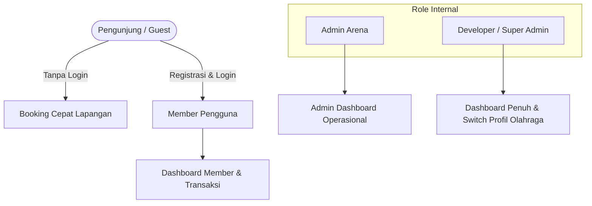
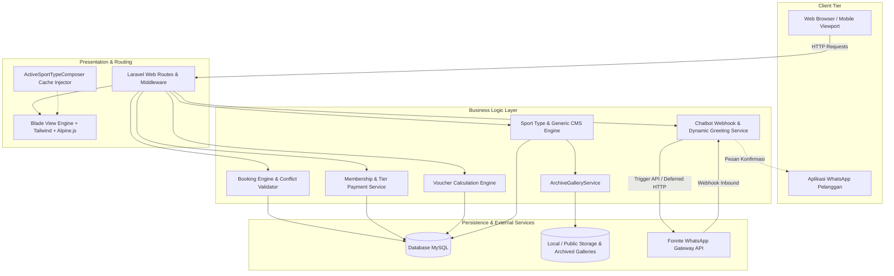
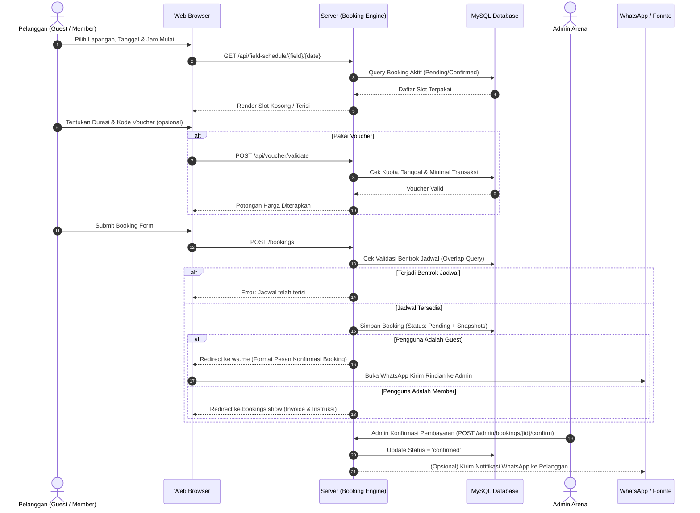
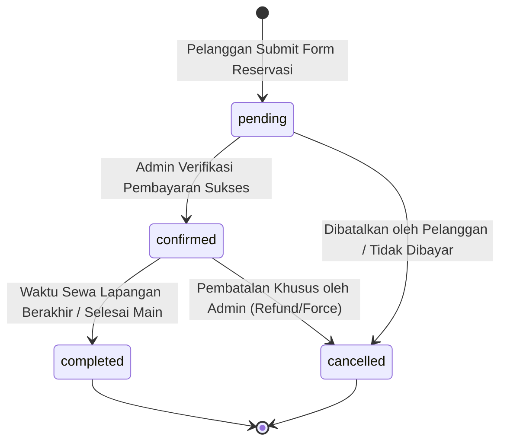
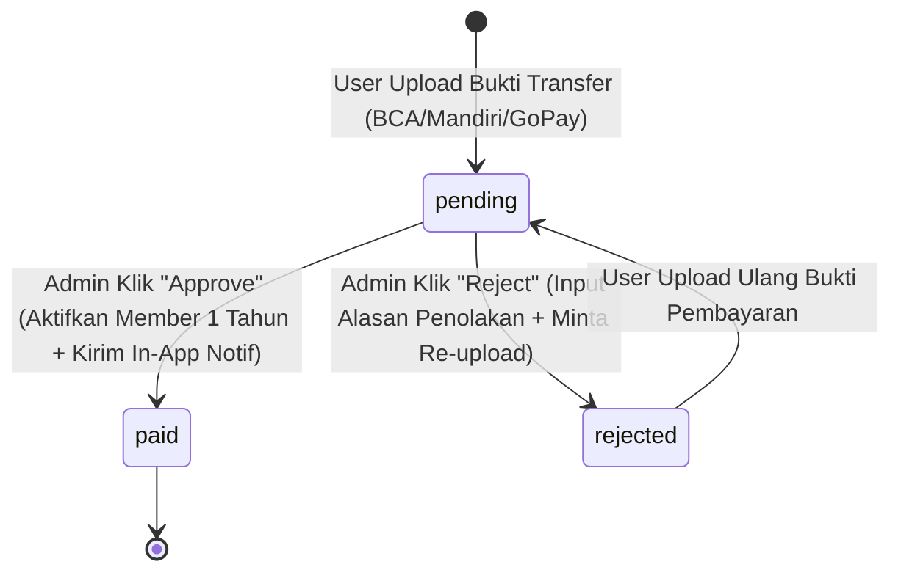
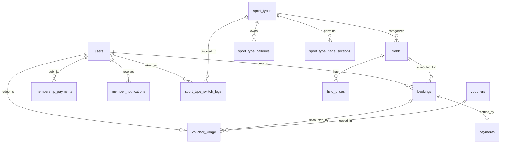

# Product Requirements Document (PRD)
# BOA Futsal Arena — Digital Arena Booking & Sports Management Platform

---

## 1. Metadata Dokumen

| Atribut | Keterangan |
|---|---|
| **Nama Produk** | BOA Futsal Arena Digital Platform (boafutsalv1) |
| **Versi Dokumen** | 3.0 (Master Comprehensive PRD) |
| **Status Dokumen** | Production Ready / Approved |
| **Tanggal Efektif** | 17 September 2026 |
| **Target Pengguna** | Pelanggan Umum (Guest), Member Komunitas (Regular/VIP/VVIP), Pengelola Lapangan (Admin), Pengembang Sistem (Developer) |
| **Tech Stack** | Laravel 12 (PHP 8.2+), Blade, Tailwind CSS 3.x, Alpine.js, Vite, MySQL / SQLite, Fonnte WhatsApp API Gateway |

---

## 2. Ringkasan Eksekutif & Latar Belakang

### 2.1 Latar Belakang Masalah
BOA Futsal Arena (berlokasi di Cilangkap, Jakarta Timur) dan arena olahraga modern pada umumnya kerap menghadapi tantangan operasional klasik:
1. **Pencatatan Manual Rentan Bentrok (Double-Booking)**: Reservasi melalui chat WhatsApp manual atau buku catatan fisik berisiko tinggi menyebabkan bentrok jadwal antar tim.
2. **Keterbatasan Operasional & Verifikasi Pembayaran Lambat**: Tim pengelola harus mengecek mutasi bank secara manual satu per satu sebelum mengonfirmasi jadwal.
3. **Struktur Tarif Kompleks & Ketiadaan Retensi Member**: Penetapan harga bervariasi antara jam kerja (*weekday*) dan akhir pekan (*weekend*), serta jam sepi (pagi/siang) vs jam prima (malam). Tanpa sistem tier membership dan promo voucher digital, arena kesulitan membangun loyalitas pelanggan berulang (*repeat booking*).
4. **Kebutuhan Adaptasi Multi-Olahraga (Sales & Pitching)**: Dalam pengembangan bisnis dan peluang franchise/kemitraan (*white-label*), platform perlu mendemokan kemampuan adaptasi untuk cabang olahraga lain (seperti Padel atau Badminton) tanpa perlu membuat ulang sistem dari nol.

### 2.2 Visi & Solusi Produk
BOA Futsal Arena Digital Platform adalah sistem informasi dan reservasi lapangan berbasis web terintegrasi. Platform ini mendigitalisasi seluruh siklus operasional arena: mulai dari pengecekan ketersediaan lapangan real-time, reservasi multi-jam (baik untuk pengunjung umum maupun member berbayar), kalkulasi harga otomatis, integrasi voucher diskon, gateway pembayaran manual & otomatis, notifikasi in-app, integrasi bot WhatsApp interaktif (Fonnte API), hingga fitur unggulan **Sport Type Switcher** dan **Generic Content Block CMS** yang memungkinkan pergantian profil olahraga secara instan tanpa jeda *deployment*.

---

## 3. Tujuan Produk & Non-Goals

### 3.1 Product Goals
1. **Otomatisasi Penuh Reservasi Lapangan**: Mengeliminasi bentrok jadwal hingga 0% melalui validasi overlapping slot di level query database.
2. **Fleksibilitas Booking Dual-Track**:
   - *Guest Track*: Pengunjung langsung bisa pesan tanpa register, diarahkan konfirmasi via WhatsApp format standar.
   - *Member Track*: Pengguna terdaftar menikmati diskon tarif per jam khusus member, riwayat sewa lengkap, voucher diskon, dan notifikasi status.
3. **Ekosistem Loyalitas & Membership Bertingkat**: Monetisasi via paket member (Regular, VIP, VVIP) dengan validasi bukti pembayaran dan hak diskon khusus.
4. **Komunikasi Otomatis via WhatsApp (Fonnte API)**: Notifikasi instan konfirmasi booking dan auto-reply ramah waktu WIB (Pagi, Siang, Sore, Malam) untuk bukti pembayaran membership.
5. **Kemampuan White-labeling & Multi-Sport Switching**: Kemudahan mendemokan dan mengubah platform untuk cabang olahraga lain (Futsal, Padel, Badminton) secara live real-time, disertai sistem arsip galeri foto aman tanpa kehilangan riwayat transaksi.
6. **Sistem CMS Fleksibel per Halaman**: Memungkinkan Admin dan Developer mengubah teks, banner, panduan, dan gambar di 5 halaman utama (Home, Sejarah, Cara Booking, Booking, Detail Booking) tanpa mengubah struktur kode Blade.

### 3.2 Non-Goals
1. Tidak mencakup penyediaan Payment Gateway escrow pihak ketiga yang menahan dana otomatis (Midtrans/Xendit) pada versi ini; verifikasi menggunakan metode transfer rekening, QRIS statis, dan tunai (Cash) dengan konfirmasi bukti bayar.
2. Tidak mencakup pergantian nomor WhatsApp bot yang berbeda-beda per cabang olahraga (nomor WhatsApp sentral tunggal).
3. Pengunjung publik tidak memilih sendiri cabang olahraga di antarmuka publik secara bebas; hanya ada 1 cabang olahraga aktif yang ditampilkan ke publik (*radio-exclusive*).
4. Data transaksi finansial/invoice historis bersifat *immutable* (tidak dapat disunting sembarangan oleh CMS konten).

---

## 4. Analisis Pengguna & Peran (User Personas & RBAC)

Sistem menerapkan Role-Based Access Control (RBAC) dengan 4 entitas pengguna:

### 4.1 Matriks Wewenang & Hak Akses (RBAC Matrix)

| Modul / Kemampuan | Guest (Publik) | Member (`user`) | Admin (`admin`) | Developer (`developer`) |
|---|:---:|:---:|:---:|:---:|
| Melihat Jadwal & Ketersediaan Lapangan Live | ✅ | ✅ | ✅ | ✅ |
| Melakukan Booking Lapangan | ✅ (Guest Form) | ✅ (Member Rate) | ✅ | ✅ |
| Menggunakan Voucher Promo | ✅ (Umum) | ✅ (Khusus Member) | ✅ | ✅ |
| Upload Bukti Pembayaran Membership | ❌ | ✅ | ❌ | ❌ |
| Mengakses Dashboard Pribadi & Riwayat | ❌ | ✅ | ❌ (Redirect Admin) | ❌ (Redirect Admin) |
| Menerima In-App Notification | ❌ | ✅ | ❌ | ❌ |
| Konfirmasi / Batal / Selesaikan Booking | ❌ | ❌ | ✅ | ✅ |
| Manajemen Akun User (CRUD & Role) | ❌ | ❌ | ✅ | ✅ |
| Verifikasi Pembayaran Member (Approve/Reject) | ❌ | ❌ | ✅ | ✅ |
| Kelola Voucher & Promo (CRUD & Toggle) | ❌ | ❌ | ✅ | ✅ |
| Konfigurasi WhatsApp Bot (Fonnte) | ❌ | ❌ | ✅ | ✅ |
| Edit Konten Teks & Gambar (CMS per Halaman) | ❌ | ❌ | ✅ | ✅ |
| CRUD Profil Cabang Olahraga Baru | ❌ | ❌ | ❌ | ✅ |
| **Switch Cabang Olahraga Aktif (Live Switch)** | ❌ | ❌ | ❌ | ✅ |
| **Hapus Profil Olahraga & Arsip Galeri** | ❌ | ❌ | ❌ | ✅ |

---

## 5. Arsitektur Sistem & Spesifikasi Teknis

### 5.1 Diagram Arsitektur Tingkat Tinggi

### 5.2 Rincian Tech Stack
- **Backend Framework**: Laravel 12.x running on PHP >= 8.2
- **Arsitektur**: Monolith Model-View-Controller (MVC) + Service Layer
- **Frontend Layer**: Laravel Blade templating engine, Tailwind CSS 3.x, Alpine.js (reactive micro-interactions), Vite bundler
- **Autentikasi**: Laravel Breeze (Cookie & Session-based authentication, CSRF protected)
- **Database Engine**: MySQL (Environment Produksi) / SQLite (Environment Local Testing & CI)
- **Komunikasi Eksternal**: Fonnte WhatsApp Gateway API (HTTP REST, Webhook, Deferred Execution)
- **Caching**: Laravel Cache Facade (`Cache::rememberForever` untuk Active Sport Type & in-memory cache flush)

---

## 6. Spesifikasi Kebutuhan Fungsional (Functional Requirements)

### 6.1 Modul 1: Portal Publik & Homepage Experience
- **FR-01.1 Landing Page Adaptif**: Menampilkan informasi hero section (judul, subjudul, background), showcase fasilitas arena, daftar lapangan aktif, galeri foto interaktif, dan formulir kontak/komentar.
- **FR-01.2 Status Lapangan Real-time**: Widget pemantau status lapangan yang mengembalikan status:
  - *Occupied*: Sedang dipakai, menampilkan nama pemesan, rentang jam, dan hitung mundur sisa menit (`remaining_minutes`).
  - *Available*: Kosong dan siap dipesan, menampilkan jadwal sewa berikutnya jika ada.
  - Interval pooling client-side: 30 detik via endpoint `GET /api/field-status`.
- **FR-01.3 Komentar & Testimoni Publik**: Pengunjung dapat mengirim komentar umum atau penawaran kolaborasi via `POST /contact`. Admin dapat memfilter pesan tipe *general* (testimoni) vs *collab* (kerjasama).
- **FR-01.4 Halaman Sejarah & Panduan**: Halaman `sejarah` dan `cara-booking` dengan konten dinamis berbasis generic CMS.

---

### 6.2 Modul 2: Lapangan & Dynamic Pricing Engine
- **FR-02.1 Manajemen Lapangan**: Admin dapat mengelola unit lapangan (`BF 01`, `BF 02`, `BF 03`), jenis rumput/lapangan (`surface_type`), foto representasi, status aktif, dan keterikatan dengan cabang olahraga (`sport_type_id`).
- **FR-02.2 Matriks Harga Berdasarkan Hari & Jam**: Tarif sewa dihitung per jam secara dinamis berdasarkan aturan tabel `field_prices`:
  - **Kategori Hari**: `weekday` (Senin–Jumat) dan `weekend` (Sabtu–Minggu).
  - **Sesi Jam**:
    - Pagi (07:00 – 12:00)
    - Siang (12:00 – 16:00)
    - Malam (16:00 – 00:00)
  - **Diferensiasi Harga**: Kolom `price_regular` (tarif umum/guest) dan `price_member` (tarif spesial member komunitas).
- **FR-02.3 Endpoint Ketersediaan Slot**: `GET /api/field-schedule/{field}/{date}` mengembalikan seluruh slot yang sudah berstatus `pending` atau `confirmed` untuk mencegah tabrakan jam sewa.

---

### 6.3 Modul 3: Booking & Reservasi Lapangan
- **FR-03.1 Validasi Anti-Overlap (Conflict Prevention)**:
  Sistem mengecek integritas waktu secara ketat sebelum menyimpan booking:
  $$\text{Overlap} \iff (T_{\text{start}} < B_{\text{end}}) \land (T_{\text{end}} > B_{\text{start}})$$
  Jika terdeteksi bentrok dengan booking aktif (`status != 'cancelled'`), transaksi langsung ditolak.
- **FR-03.2 Durasi Sewa**: Mendukung pemilihan durasi 1 hingga 8 jam sewa berturut-turut.
- **FR-03.3 Dual Booking Workflow**:
  - **Alur Guest**: Wajib mengisi nama lengkap, email, nomor HP/WhatsApp. Sistem membuat booking berstatus `pending`, membuat pesan template konfirmasi berformat khusus, lalu me-redirect pemesan langsung ke WhatsApp Admin Arena (`https://wa.me/...`).
  - **Alur Member Terdaftar**: Otomatis mengaitkan `user_id`, menerapkan tarif `price_member`, menyimpan riwayat ke dashboard, dan mengarahkan pengguna ke halaman rincian booking (`bookings.show`).
- **FR-03.4 Snapshot Integritas Transaksi**: Saat booking dibuat, nama lapangan dan nama cabang olahraga disimpan secara permanen di kolom snapshot (`field_name_snapshot` dan `sport_type_name_snapshot`). Hal ini menjamin bahwa invoice historis tidak berubah meskipun profil lapangan atau olahraga diedit/dihapus di masa depan.

---

### 6.4 Modul 4: Sistem Membership & Pembayaran Bertingkat
- **FR-04.1 Tier Membership**: Pengguna terdaftar dapat bergabung ke dalam 3 level keanggotaan:
  1. **Regular**: Biaya registrasi tahunan Rp 150.000 (diskon sewa reguler).
  2. **VIP**: Biaya registrasi tahunan Rp 250.000 (prioritas booking + diskon khusus).
  3. **VVIP**: Biaya registrasi tahunan Rp 500.000 (akses penuh + potongan maksimal).
- **FR-04.2 Alur Verifikasi Pembayaran**:
  1. Pengguna memilih metode transfer (BCA, Mandiri, GoPay), mengunggah berkas gambar struk (`payment_proof`).
  2. Transaksi tercatat di tabel `membership_payments` dengan status `pending` dan kode transaksi unik `TRX-{time}-{user_id}`.
  3. Sistem memicu auto-redirect ke nomor WhatsApp pengelola arena untuk konfirmasi.
  4. Admin meninjau berkas di halaman `/admin/membership-payments`:
     - **Approve**: Status pembayaran berubah jadi `paid`, `users.is_member` menjadi `true`, tier diset, masa berlaku diset 1 tahun (`expired_at = now() + 1 year`), dan sistem mengirimkan notifikasi in-app ke pengguna.
     - **Reject**: Admin menyertakan alasan penolakan (`rejection_reason`), status menjadi `rejected`, dan notifikasi peringatan terkirim ke pengguna untuk upload ulang.

---

### 6.5 Modul 5: Sistem Promosi & Voucher Diskon
- **FR-05.1 Tipe Diskon**:
  - `percentage`: Pemotongan berdasarkan persentase harga sewa, dengan pembatasan nilai diskon maksimal (`max_discount`).
  - `fixed`: Pemotongan nilai nominal tetap (misal: potongan Rp 25.000).
- **FR-05.2 Batasan & Validasi Aturan Voucher**:
  - Periode aktif: `valid_from` hingga `valid_until`.
  - Nominal booking minimum (`min_booking_amount`).
  - Batas kuota pemakaian global (`usage_limit`).
  - Batas frekuensi per akun user (`usage_per_user`).
  - Hari berlaku spesifik (`applicable_days`, misal: hanya berlaku hari Selasa dan Rabu).
  - Hak akses eksklusif member (`is_member_only`).
- **FR-05.3 Validasi Real-time AJAX**: Endpoint `POST /api/voucher/validate` memvalidasi kelayakan voucher secara instan di form booking sebelum pembayaran disubmit.

---

### 6.6 Modul 6: Integrasi WhatsApp Chatbot (Fonnte Gateway)
- **FR-06.1 Auto-Reply Berbasis Webhook**: Endpoint `POST /webhook/fonnte` menerima pesan masuk dari pelanggan.
- **FR-06.2 Deteksi Kata Kunci Cerdas**: Mendeteksi intent pesan yang mengandung kata kunci: `join member`, `bukti pembayaran`, `approve`, `membership`. Pesan acak lainnya diabaikan agar tidak mengganggu operasional.
- **FR-06.3 Greeting Dinamis Berbasis Waktu WIB (Asia/Jakarta)**:
  - 04:00 – 10:59: Selamat **Pagi**
  - 11:00 – 14:59: Selamat **Siang**
  - 15:00 – 17:59: Selamat **Sore**
  - 18:00 – 03:59: Selamat **Malam**
- **FR-06.4 Deferred Background Execution**: Pengiriman balasan pesan via Fonnte API (`https://api.fonnte.com/send`) dieksekusi melalui closure `defer()` Laravel. Hal ini mencegah latensi jaringan eksternal menyebabkan timeout pada webhook Fonnte.
- **FR-06.5 Placeholder Pesan Booking Dinamis**: Layanan `BookingMessageService` mendukung pembuatan pesan terstruktur menggunakan snapshot data transaksi:
  `"Halo {nama}, booking Anda di {nama_lapangan} ({jenis_olahraga}) pada {tanggal} jam {jam} sudah dikonfirmasi. Total: Rp {total}. Booking ID: {booking_id}."`

---

### 6.7 Modul 7: Multi-Sport Type Switcher & Generic CMS
- **FR-07.1 Switch Profil Cabang Olahraga Seketika (Live Switch)**:
  - Role `developer` dapat memilih profil olahraga yang aktif (misal: beralih dari "Futsal" ke "Padel" atau "Badminton").
  - Sistem mengeksekusi *cache flush* (`Cache::forget('active_sport_type')`).
  - Seluruh halaman publik langsung menampilkan profil, banner, lapangan, dan fasilitas olahraga yang baru tanpa perlu proses build ulang maupun tahap staging.
  - Validasi ketat: Profil tidak dapat diaktifkan jika belum memiliki minimal 1 lapangan aktif yang telah dilengkapi daftar harga.
- **FR-07.2 Generic Content Block CMS (`sport_type_page_sections`)**:
  - Mendukung pengelolaan konten dinamis di 5 halaman:
    1. `home`: Hero title, subtitle, deskripsi, fasilitas arena.
    2. `sejarah`: Narasi profil arena, milestone perjalanan, foto venue.
    3. `cara_booking`: Panduan langkah demi langkah sewa lapangan.
    4. `booking`: Banner petunjuk pemesanan dan syarat kebijakan DP.
    5. `booking_detail`: Header reservasi, kebijakan pembatalan/reschedule, dan teks call-to-action kontak WhatsApp.
  - Tipe data konten yang didukung: `text`, `richtext`, `image`, dan `list_item` (disimpan dalam format JSON).
- **FR-07.3 Decommissioning & Arsip Galeri Aman**:
  - Saat suatu profil olahraga dihapus oleh Developer, file fisik galeri **tidak dihapus secara permanen**.
  - `ArchiveGalleryService` memindahkan seluruh foto galeri ke direktori arsip:
    `storage/app/archived-galleries/{slug}-{timestamp}/`
  - Riwayat transaksi masa lalu tetap utuh berkat integritas snapshot booking.
- **FR-07.4 Audit Log Perpindahan**: Setiap aksi switch aktif atau penghapusan profil dicatat di tabel `sport_type_switch_logs` beserta identitas user dan stempel waktu.

---

### 6.8 Modul 8: Backoffice Admin Dashboard
- **FR-08.1 Analitik Ringkasan (KPI Cards)**: Menampilkan Total Booking, Booking Pending, Booking Terkonfirmasi, Jumlah Member Terdaftar, Total Pendapatan Sah, Estimasi Pendapatan Pending, dan Pesan Kerjasama Masuk.
- **FR-08.2 Siklus Hidup Booking**: Admin dapat memperbarui status booking secara real-time:
  - Konfirmasi (`confirmBooking`)
  - Batalkan (`cancelBooking`)
  - Selesaikan Sesi Main (`finishBooking`)
  - Hapus Booking (`deleteBooking`)
- **FR-08.3 Manajemen Pengguna**: CRUD akun pengguna, pencarian data member, pengubahan role (`user`, `admin`), dan status keanggotaan.
- **FR-08.4 Moderasi Komentar & Pesan**: Pengelolaan pesan kontak masuk, penandaan pesan telah dibaca, dan penghapusan komentar publik yang tidak relevan.

---

## 7. Diagram Alur & State Transition

### 7.1 Alur Transaksi Reservasi Lapangan

### 7.2 Siklus Status Booking (State Machine)

### 7.3 Siklus Pembayaran Membership

---

## 8. Struktur & Skema Database (Data Dictionary)

### 8.1 Entity Relationship Diagram (ERD)

### 8.2 Rincian Kamus Data (Data Dictionary)

#### 1. Tabel `users`
| Nama Kolom | Tipe Data | Kunci | Keterangan |
|---|---|:---:|---|
| `id_user` | BIGINT UNSIGNED | PK | Identifikator unik pengguna |
| `name` | VARCHAR(255) | | Nama lengkap pengguna |
| `email` | VARCHAR(255) | Unique | Alamat surel aktif |
| `phone` | VARCHAR(20) | Nullable | Nomor handphone / WhatsApp |
| `password` | VARCHAR(255) | | Hash kata sandi |
| `role` | ENUM('user','admin','developer') | | Hak akses sistem (default: `user`) |
| `is_member` | BOOLEAN | | Status aktif member komunitas (default: `false`) |
| `membership_tier` | VARCHAR(50) | Nullable | Tier membership: `regular`, `vip`, `vvip` |
| `membership_expired_at`| DATETIME | Nullable | Batas waktu kadaluwarsa langganan member |
| `email_verified_at`| TIMESTAMP | Nullable | Waktu verifikasi email |
| `created_at` / `updated_at` | TIMESTAMP | | Stempel waktu pembuatan & pembaruan |

#### 2. Tabel `sport_types`
| Nama Kolom | Tipe Data | Kunci | Keterangan |
|---|---|:---:|---|
| `id` | BIGINT UNSIGNED | PK | Identifikator cabang olahraga |
| `name` | VARCHAR(255) | | Nama cabang (e.g. Futsal, Padel, Badminton) |
| `slug` | VARCHAR(255) | Unique | Slug URL ramah SEO |
| `hero_title` | VARCHAR(255) | | Judul besar pada hero section |
| `hero_subtitle` | TEXT | Nullable | Subjudul / slogan pada hero section |
| `description` | TEXT | Nullable | Ringkasan narasi cabang olahraga |
| `hero_image_path` | VARCHAR(255) | Nullable | Path foto latar hero section |
| `facilities` | JSON | Nullable | Array fasilitas arena: `[{name, desc, icon}]` |
| `meta_title` / `meta_desc`| VARCHAR(255) | Nullable | Metadata SEO |
| `is_active` | BOOLEAN | | Penanda aktif publik (hanya 1 record `true`) |
| `created_at` / `updated_at` | TIMESTAMP | | Stempel waktu |

#### 3. Tabel `fields`
| Nama Kolom | Tipe Data | Kunci | Keterangan |
|---|---|:---:|---|
| `id_field` | BIGINT UNSIGNED | PK | Identifikator unit lapangan |
| `sport_type_id` | BIGINT UNSIGNED | FK | Relasi ke `sport_types.id` (`onDelete set null`) |
| `name` | VARCHAR(255) | | Nama lapangan (e.g. BF 01, BF 02, BF 03) |
| `description` | TEXT | Nullable | Rincian dimensi / spesifikasi lapangan |
| `image` | VARCHAR(255) | Nullable | Foto utama lapangan |
| `surface_type` | VARCHAR(100) | | Tipe lantai (Rumput Sintetis, Interlock, Vinyl, Karpet) |
| `is_active` | BOOLEAN | | Ketersediaan operasional lapangan |
| `created_at` / `updated_at` | TIMESTAMP | | Stempel waktu |

#### 4. Tabel `field_prices`
| Nama Kolom | Tipe Data | Kunci | Keterangan |
|---|---|:---:|---|
| `id` | BIGINT UNSIGNED | PK | Identifikator tarif |
| `field_id` | BIGINT UNSIGNED | FK | Relasi ke `fields.id_field` |
| `day_type` | ENUM('weekday','weekend') | | Klasifikasi hari |
| `start_time` | TIME | | Jam awal sesi (e.g. 07:00, 12:00, 16:00) |
| `end_time` | TIME | | Jam akhir sesi (e.g. 12:00, 16:00, 00:00) |
| `price_regular` | DECIMAL(10,2) | | Harga sewa per jam untuk pengguna non-member |
| `price_member` | DECIMAL(10,2) | | Harga sewa per jam untuk member aktif |
| `created_at` / `updated_at` | TIMESTAMP | | Stempel waktu |

#### 5. Tabel `bookings`
| Nama Kolom | Tipe Data | Kunci | Keterangan |
|---|---|:---:|---|
| `id_booking` | BIGINT UNSIGNED | PK | Identifikator unik reservasi |
| `user_id` | BIGINT UNSIGNED | FK | Pemesan terdaftar (Nullable jika booking via Guest) |
| `field_id` | BIGINT UNSIGNED | FK | Lapangan yang disewa |
| `sport_type_name_snapshot` | VARCHAR(255) | | Snapshot nama cabang olahraga saat booking dibuat |
| `field_name_snapshot` | VARCHAR(255) | | Snapshot nama lapangan saat booking dibuat |
| `booking_type` | ENUM('guest','member') | | Metode jalur pemesanan |
| `guest_name` / `email` / `phone` | VARCHAR | Nullable | Identitas pemesan khusus jalur Guest |
| `booking_date` | DATE | | Tanggal pelaksanaan sewa |
| `start_time` / `end_time` | TIME | | Rentang jam main |
| `duration_hours` | INT | | Total durasi sewa (1 - 8 jam) |
| `price_per_hour` | DECIMAL(10,2) | | Tarif per jam yang diberlakukan |
| `original_price` | DECIMAL(10,2) | | Subtotal sebelum potongan promo |
| `discount_amount` | DECIMAL(10,2) | | Nilai potongan voucher diskon |
| `total_price` | DECIMAL(10,2) | | Total akhir tagihan pembayaran |
| `voucher_id` / `voucher_code`| Variabel | Nullable | Referensi voucher yang dipakai |
| `is_member_price` | BOOLEAN | | Flag penanda pemakaian tarif member |
| `status` | ENUM('pending','confirmed','cancelled','completed') | | Status transaksi reservasi |
| `notes` | TEXT | Nullable | Catatan khusus dari pemesan |
| `created_at` / `updated_at` | TIMESTAMP | | Stempel waktu |

#### 6. Tabel `sport_type_page_sections`
| Nama Kolom | Tipe Data | Kunci | Keterangan |
|---|---|:---:|---|
| `id` | BIGINT UNSIGNED | PK | Identifikator blok konten |
| `sport_type_id` | BIGINT UNSIGNED | FK | Relasi ke `sport_types.id` (`cascade on delete`) |
| `page_key` | VARCHAR(50) | Index | Halaman: `home`, `sejarah`, `cara_booking`, `booking`, `booking_detail` |
| `section_key` | VARCHAR(100) | Index | Kunci section unik (e.g. `hero`, `step_1`, `policy_note`) |
| `label` | VARCHAR(255) | | Label antarmuka form admin |
| `content_type` | ENUM('text','richtext','image','list_item') | | Format tipe data input editor |
| `content_value` | LONGTEXT | Nullable | Teks biasa / HTML rich-text / JSON string untuk list |
| `image_path` | VARCHAR(255) | Nullable | Path gambar tersimpan |
| `order` | INT | | Urutan tampilan (default: 0) |
| `created_at` / `updated_at` | TIMESTAMP | | Stempel waktu |

#### 7. Tabel `membership_payments`
| Nama Kolom | Tipe Data | Kunci | Keterangan |
|---|---|:---:|---|
| `id` | BIGINT UNSIGNED | PK | Identifikator pembayaran member |
| `user_id` | BIGINT UNSIGNED | FK | Relasi ke `users.id_user` |
| `transaction_id` | VARCHAR(100) | Unique | Kode unik transaksi (`TRX-...`) |
| `payment_method` | ENUM('BCA','Mandiri','GoPay') | | Pilihan channel transfer |
| `membership_tier` | ENUM('regular','vip','vvip') | | Paket langganan yang dipilih |
| `amount` | DECIMAL(10,2) | | Nominal transfer (150k / 250k / 500k) |
| `payment_proof` | VARCHAR(255) | | Path file gambar struk bukti transfer |
| `status` | ENUM('pending','paid','rejected') | | Status persetujuan pembayaran |
| `rejection_reason` | TEXT | Nullable | Alasan verifikator jika pembayaran ditolak |
| `payment_date` | TIMESTAMP | Nullable | Waktu saat pembayaran disetujui |
| `expired_at` | TIMESTAMP | Nullable | Batas akhir masa berlaku keanggotaan |

#### 8. Tabel `vouchers` & `voucher_usage`
- `vouchers`: Menyimpan kode voucher unik, tipe (`percentage`/`fixed`), nominal potongan, masa aktif (`valid_from` - `valid_until`), batas kuota sewa (`usage_limit`), dan filter hari/member.
- `voucher_usage`: Log pemakaian voucher per transaksi booking (`voucher_id`, `user_id`, `booking_id`, `discount_amount`, `used_at`).

#### 9. Tabel `chatbot_settings`
- Menyimpan nomor WhatsApp bot (`wa_number`), Fonnte API token (`api_token`), template pesan pengguna (`user_message_template`), template auto-reply sistem (`reply_message_template`), dan saklar keaktifan bot (`is_active`).

#### 10. Tabel `sport_type_galleries` & `sport_type_switch_logs`
- `sport_type_galleries`: Menyimpan berkas foto showcase arena per cabang olahraga. Jika cabang olahraga dihapus, kolom `archived_path` dan `archived_at` terisi sebagai bukti pemindahan ke storage arsip.
- `sport_type_switch_logs`: Mencatat riwayat audit pemindahan cabang olahraga (`user_id`, `from_sport_type_id`, `to_sport_type_id`, `action`, `created_at`).

---

## 9. Antarmuka Pemrograman Aplikasi (API Endpoints Directory)

| HTTP Method | Endpoint URI | Akses | Deskripsi & Respons |
|---|---|:---:|---|
| `GET` | `/api/field-status` | Publik | Mendapatkan status seluruh lapangan secara real-time (occupied/available, sisa waktu menit). |
| `GET` | `/api/field-schedule/{field}/{date}` | Publik | Mendapatkan daftar rentang jam sewa yang telah terisi pada lapangan & tanggal tertentu. |
| `POST` | `/api/voucher/validate` | Publik | Validasi kelayakan kode voucher terhadap nominal booking & tanggal; mengembalikan nilai diskon. |
| `POST` | `/webhook/fonnte` | Publik / Webhook | Endpoint webhook masuk dari Fonnte WhatsApp Gateway untuk auto-reply bot. |
| `POST` | `/contact` | Publik | Mengirim formulir pesan kontak/komentar umum atau proposal kerjasama. |
| `GET` | `/api/public-comments` | Publik | Mengambil daftar komentar publik untuk ditampilkan pada carousel landing page. |
| `GET` | `/api/notifications` | Auth Member | Mendapatkan daftar notifikasi in-app untuk pengguna yang sedang login. |
| `GET` | `/api/notifications/unread-count` | Auth Member | Mengambil jumlah notifikasi yang belum dibaca. |
| `POST` | `/api/notifications/{id}/read` | Auth Member | Menandai satu notifikasi in-app sebagai telah dibaca. |
| `POST` | `/api/notifications/read-all` | Auth Member | Menandai seluruh notifikasi pengguna sebagai telah dibaca. |

---

## 10. Kebutuhan Non-Fungsional (Non-Functional Requirements)

### 10.1 Performa & Throughput
- **Waktu Muat Halaman (Page Load Speed)**: First Contentful Paint (FCP) halaman publik < 1.5 detik pada koneksi standar 4G.
- **Efisiensi Kueri & Caching**:
  - Model `SportType` aktif di-cache permanen di memory via `Cache::rememberForever('active_sport_type', ...)`.
  - Invalidation cache terjadi otomatis dan instan saat Admin/Developer menyimpan perubahan konten atau melakukan *live switch*.
- **Asynchronous Execution**: Pengiriman pesan keluar ke Fonnte API dibungkus fungsi `defer()` agar respons webhook tetap instan (< 300 ms) tanpa terhambat latensi jaringan pihak ketiga.

### 10.2 Keamanan & Integritas Data
- **Proteksi Otorisasi di Server-Side**: Proteksi route krusial menggunakan custom middleware:
  - `AdminMiddleware`: Menolak akses pengguna biasa ke prefix `/admin/*`.
  - `EnsureDeveloperRole` (`developer` middleware): Menolak akun Admin biasa pada aksi destruktif (`activate` dan `destroy` Sport Type) dengan respons HTTP 403 Forbidden.
- **Pencegahan Injeksi & Serangan Web**:
  - CSRF Token verification pada seluruh request `POST`, `PUT`, `DELETE`.
  - Prepared statements Eloquent ORM mencegah SQL Injection.
  - Sanitasi file upload (validasi MIME types `jpeg, png, jpg, gif` dan limit berkas maksimal 2MB - 5MB).
- **Snapshot Immutability**: Riwayat booking mengunci identitas lapangan dan nama olahraga dalam format teks statis, sehingga keabsahan invoice masa lalu tidak dapat terdistorsi oleh revisi data master.

### 10.3 Reliabilitas & Penanganan Kegagalan (Reliability & Edge Cases)
- **Penanganan Webhook Deadlock**: Jika token Fonnte kosong atau kedaluwarsa, sistem mencatat `Log::warning` tanpa melempar fatal crash 500 ke server webhook pengirim.
- **Pencegahan Penghapusan Data Aktif**: Sistem secara otomatis menolak penghapusan cabang olahraga yang statusnya sedang aktif (`is_active == true`). Pengembang wajib memindahkan status aktif ke cabang lain terlebih dahulu.
- **Graceful Asset Archiving**: Saat cabang olahraga dihapus, sistem memindahkan berkas fisik galeri ke direktori penyimpanan khusus (`archived-galleries`) dengan penamaan folder berbasis timestamp untuk mencegah tabrakan nama file.

---

## 11. Rencana Peluncuran & Pentahapan Rilis (Release Phasing)

| Fase | Milestone / Cakupan Modul | Target Deliverables | Status |
|---|---|---|:---:|
| **Fase 1** | Fondasi Basis Data & Autentikasi | Skema users, fields, bookings, role RBAC, Breeze Auth, migrasi awal | ✅ Selesai |
| **Fase 2** | Dynamic Pricing & Slot Conflict Engine | Tabel `field_prices`, kalkulasi jam sewa, validasi overlap slot, API schedule | ✅ Selesai |
| **Fase 3** | Guest Booking & Integrasi WhatsApp Redirect | Form reservasi guest, template URL wa.me, polling status lapangan 30 detik | ✅ Selesai |
| **Fase 4** | Membership Tiering & Verifikasi Pembayaran | Paket Regular/VIP/VVIP, upload struk, persetujuan/penolakan admin, in-app notif | ✅ Selesai |
| **Fase 5** | Sistem Voucher & Promosi Digital | Skema voucher, kalkulasi persentase/flat, limit pemakaian, AJAX validator | ✅ Selesai |
| **Fase 6** | WhatsApp Chatbot Auto-Reply (Fonnte API) | Webhook Fonnte, salam berbasis waktu WIB, deferred API sender, template config | ✅ Selesai |
| **Fase 7** | Multi-Sport Type Switcher (Sales Enablement) | Role `developer`, switch live real-time, audit log, arsip galeri aman | ✅ Selesai |
| **Fase 8** | Generic Page Sections CMS (Opsi B) | Skema `sport_type_page_sections`, editor per section 5 halaman publik | ✅ Selesai |
| **Fase 9** | Pengujian Terintegrasi (UAT) & Hardening | Stress-test concurrent booking, audit keamanan role, optimasi bundle Vite | 🔄 Berjalan |
| **Fase 10** | Go-Live & Handover Operasional | Pelatihan staf kasir/admin arena, rilis domain produksi, monitoring log | 🔜 Terjadwal |

---

## 12. Metrik Keberhasilan Produk (Success Metrics & KPIs)

### 12.1 Metrik Bisnis (Business KPIs)
1. **Zero Double-Booking Incident**: 0 insiden jadwal bentrok sejak sistem diterapkan.
2. **Pertumbuhan Tingkat Okupansi Lapangan**: Peningkatan okupansi jam sepi (pagi dan siang weekday) minimal 25% berkat diferensiasi tarif dinamis.
3. **Konversi Pelanggan Menjadi Member**: Minimal 20% pemesan berulang melakukan upgrade ke paket member (Regular/VIP/VVIP) dalam 3 bulan pertama.
4. **Efisiensi Waktu Respon Operasional**: Penurunan waktu konfirmasi reservasi dari rata-rata 30 menit (manual chat) menjadi < 2 menit dengan validasi terpusat dan notifikasi otomatis.

### 12.2 Metrik Teknis (Technical KPIs)
1. **Kecepatan Switch Profil Olahraga**: Pergantian identitas cabang olahraga (Futsal ke Padel/Badminton) tereksekusi **< 5 detik** dan langsung terlihat pada halaman publik tanpa server restart.
2. **Integritas Arsip Data**: 100% berkas galeri tersimpan utuh di storage arsip saat terjadi proses penghapusan profil olahraga yang tidak dipakai.
3. **Uptime & Ketersediaan Webhook**: Ketersediaan respons webhook Fonnte mencapai 99.8% tanpa terjadi request drop akibat proses sinkronus.
4. **Respon Kueri Database**: Waktu eksekusi kueri ketersediaan slot lapangan (`/api/field-schedule`) < 100 ms pada beban 50 request bersamaan.

---

> **Catatan Dokumen**: Spesifikasi kebutuhan produk ini merefleksikan seluruh arsitektur, basis data, dan kode sumber aktual pada repositori BOA Futsal Arena Platform (Laravel 12 / boafutsalv1). Dokumen ini sah sebagai panduan referensi utama bagi tim pengembang, QA, manajer proyek, serta pemangku kepentingan bisnis.
