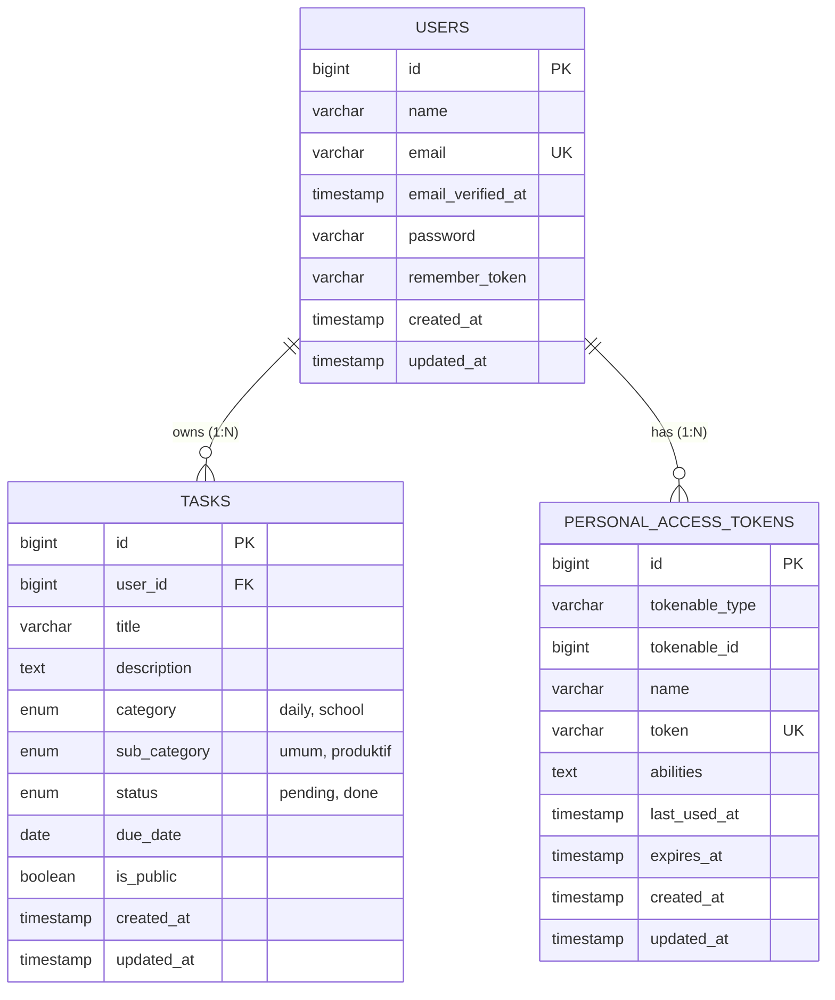

# Product Requirement Document (PRD)
## DailyLife Task Manager & RESTful API

---

### Informasi Dokumen
- **Nama Produk:** DailyLife Task Manager & RESTful API
- **Versi Dokumen:** 1.0.0
- **Status:** Approved / Production Ready
- **Tanggal Rilis Dokumen:** 17 September 2026
- **Target Pembaca:** Engineering Team (Backend & Frontend), QA/Tester, Project Manager, API Consumer

---

## 1. Executive Summary & Ringkasan Produk

### 1.1 Latar Belakang & Permasalahan
Dalam rutinitas harian dan kegiatan akademik, individu sering kali kesulitan melacak berbagai jenis tugas yang memiliki urgensi dan konteks berbeda (seperti urusan harian rumah tangga vs tugas sekolah/kuliah umum vs proyek produktif). Ketiadaan sistem pencatatan yang terstruktur, fleksibel, dan terintegrasi sering berujung pada terlewatnya tenggat waktu (*deadline*) serta hilangnya fokus harian. Selain itu, banyak aplikasi To-Do List bersifat *closed-silo*, tidak menyediakan antarmuka API yang dapat diintegrasikan dengan aplikasi lain (misal: mobile client, bot pengingat, atau otomasi pihak ketiga).

### 1.2 Visi & Tujuan Produk
**DailyLife Task Manager** hadir sebagai platform produktivitas harian yang menyediakan dua akses utama:
1. **Web Dashboard Antarmuka Pengguna (UI):** Antarmuka web yang bersih, responsif, dan intuitif menggunakan Laravel Blade dan Tailwind CSS v4 untuk pengelolaan tugas langsung oleh pengguna.
2. **Headless RESTful API:** Antarmuka backend yang aman dan terdokumentasi rapi berbasis Laravel Sanctum, memungkinkan integrasi multi-platform (Android, iOS, CLI, atau integrasi pihak ketiga).

Sistem ini mengelompokkan tugas ke dalam kategori utama (`daily` dan `school`) dengan sub-kategori spesifik (`umum` dan `produktif`), serta mendukung visibilitas publik bagi pengguna yang ingin membagikan daftar tugas inspiratif atau referensi kepada publik.

---

## 2. Target Pengguna & Persona

| Persona | Profil & Kebutuhan | Kebutuhan Utama pada Sistem |
| :--- | :--- | :--- |
| **Pelajar / Mahasiswa (Academic User)** | Memiliki banyak tugas mata pelajaran umum dan proyek produktif dengan tenggat waktu ketat. | Kategorisasi tugas sekolah (`umum` vs `produktif`), visualisasi status selesai/belum, dan pencatatan due date. |
| **Individu Produktif (Daily Routine User)** | Pengguna harian yang ingin mengatur rutinitas rumah tangga, olahraga, atau belanja harian. | Kategori `daily`, tampilan ringkas per kelompok tugas, kemudahan aksi cepat "Mark as Done". |
| **Pengembang / Integrator (API Consumer)** | Developer pihak ketiga atau tim pengembang mobile app yang membutuhkan backend To-Do service. | RESTful API standar dengan token Bearer Sanctum, format respon JSON konsisten, paginasi data, dan endpoint publik. |

---

## 3. Ruang Lingkup Proyek (Scope of Work)

### 3.1 Dalam Ruang Lingkup (In-Scope)
- **Autentikasi Ganda:** Autentikasi sesi berbasis Web (Login, Register, Logout) dan autentikasi token Bearer berbasis REST API (Laravel Sanctum).
- **Manajemen Tugas (CRUD):** Tambah, lihat detail, perbarui, hapus tugas, dan aksi cepat penandaan status selesai (`done`).
- **Sistem Kategorisasi Spesifik:**
  - Kategori Utama: `daily` (harian), `school` (akademik).
  - Sub-kategori: `umum` (tugas teori/pelajaran umum), `produktif` (proyek kejuruan/praktikum).
- **Penyaringan & Paginasi Data:** Filter dinamis berdasarkan status (`pending`/`done`), kategori, dan sub-kategori. Paginasi data pada level database.
- **Dukungan Tugas Publik:** Kemampuan membagikan tugas publik (`is_public = true`) yang dapat diakses secara publik tanpa token melalui endpoint `/api/public/tasks`.
- **Keamanan Isolasi Data (Ownership Enforcement):** Pengguna hanya berhak membaca, memperbarui, atau menghapus data tugas miliknya sendiri (HTTP 403 Forbidden bila melanggar).

### 3.2 Di Luar Ruang Lingkup (Out-of-Scope - Phase 1)
- Notifikasi push / email pengingat sebelum due date (direncanakan untuk Phase 2).
- Fitur kolaborasi multi-user dalam 1 task (task assignment).
- Unggah berkas lampiran (file attachments) pada tugas.
- Integrasi pihak ketiga langsung (Google Calendar, Notion sync).

---

## 4. Arsitektur Sistem & Spesifikasi Teknologi

```
+-------------------------------------------------------------+
|                      Client Layer                           |
|   +-----------------------+     +-----------------------+   |
|   |   Web Browser (UI)    |     | Mobile / API Client   |   |
|   +-----------+-----------+     +-----------+-----------+   |
+---------------|-----------------------------|---------------+
                | HTTP (Session/CSRF)         | HTTP (Bearer Token)
+---------------v-----------------------------v---------------+
|                   Application Layer (Laravel 13)            |
|   +-----------------------------------------------------+   |
|   |                     Routing Layer                   |   |
|   |        routes/web.php    |     routes/api.php       |   |
|   +--------------------------+--------------------------+   |
|   |                   Middleware Layer                  |   |
|   |        auth (Session)    |   auth:sanctum (Token)   |   |
|   +--------------------------+--------------------------+   |
|   |                   Controller Layer                  |   |
|   | WebTaskController        | TaskController           |   |
|   | WebAuthController        | AuthController           |   |
|   |                          | PublicTaskController     |   |
|   +--------------------------+--------------------------+   |
|   |         Validation & Presentation Layer             |   |
|   | StoreTaskRequest         | TaskResource             |   |
|   | UpdateTaskRequest        | Blade Templates          |   |
|   +--------------------------+--------------------------+   |
|   |                      Model Layer                    |   |
|   |                 User <---> Task (1:N)               |   |
+------------------------------+------------------------------+
                               | Eloquent ORM
+------------------------------v------------------------------+
|                     Data Storage Layer                      |
|                  MySQL Database (InnoDB)                    |
|       - users                                               |
|       - tasks (Foreign Key: user_id ON DELETE CASCADE)      |
|       - personal_access_tokens                              |
+-------------------------------------------------------------+
```

### 4.1 Tech Stack
- **Framework Utama:** Laravel 13.x (PHP 8.2+)
- **Autentikasi API:** Laravel Sanctum (Personal Access Token)
- **Database:** MySQL 8.x / MariaDB
- **Frontend Web:** Laravel Blade + Tailwind CSS v4 + Vite
- **Desain Arsitektur:** Dual-Access Monolith (RESTful API & Server-Side Rendered UI)

---

## 5. Kebutuhan Fungsional (Functional Requirements)

### FR-01: Autentikasi Pengguna & Manajemen Sesi

#### User Story
- Sebagai pengguna baru, saya dapat mendaftarkan akun dengan memasukkan nama, email, dan password agar data tugas saya tersimpan secara terisolasi.
- Sebagai pengguna terdaftar, saya dapat melakukan login melalui Web UI maupun meminta Bearer Token melalui API.
- Sebagai pengguna aktif, saya dapat melakukan logout untuk mencabut token akses saya atau mematikan sesi web.

#### Kriteria Penerimaan (Acceptance Criteria)
1. **Pendaftaran (Registration):**
   - Input: `name` (required, max:255), `email` (required, email valid, unique pada tabel `users`), `password` (required, min:8, confirmed).
   - Password disimpan dengan hashing aman (`Hash::make` / Bcrypt).
   - Pada request API (`POST /api/register`), mengembalikan HTTP status `201 Created` beserta objek user dan `plainTextToken`.
2. **Masuk (Login):**
   - Kredensial tidak valid mengembalikan HTTP `401 Unauthorized` dengan pesan `"Invalid credentials."`.
   - Kredensial valid menghasilkan token akses Sanctum baru (`auth_token`).
3. **Keluar (Logout):**
   - Pada API (`POST /api/logout`), token aktif yang bersangkutan dihapus dari database (`currentAccessToken()->delete()`). Token tersebut tidak dapat dipakai kembali.
   - Pada Web UI (`POST /logout`), session pengguna di-invalidate dan di-regenerate token CSRF.

---

### FR-02: Manajemen Tugas (Task Management - CRUD)

#### User Story
- Sebagai pengguna terautentikasi, saya dapat membuat tugas baru dengan menyertakan judul, kategori, sub-kategori, batas waktu (*due date*), catatan deskripsi, serta menentukan apakah tugas bersifat publik atau privat.
- Sebagai pengguna, saya dapat melihat daftar tugas pribadi, melihat rincian suatu tugas, mengedit data tugas, dan menghapus tugas yang sudah tidak relevan.
- Sebagai pengguna, saya dapat menandai tugas sebagai selesai (*mark as done*) dengan satu klik atau satu request cepat.

#### Kriteria Penerimaan (Acceptance Criteria)
1. **Pembuatan Tugas (Create Task):**
   - Validasi: `title` (required, string, max:255), `category` (required, in: `daily`, `school`), `sub_category` (nullable, in: `umum`, `produktif`), `status` (nullable, default: `pending`), `due_date` (nullable, format tanggal valid), `is_public` (nullable, boolean, default: `false`).
   - Setiap tugas yang dibuat otomatis mengikat ID pemilik (`user_id`) sesuai dengan user yang sedang login (`$request->user()->tasks()->create(...)`).
2. **Pembaruan Tugas (Update Task):**
   - Field bersifat `sometimes` validasi: hanya memvalidasi field yang dikirim pada request `PUT`/`PATCH`.
3. **Penyelesaian Cepat (Mark as Done):**
   - Menggunakan endpoint khusus `PATCH /api/tasks/{id}/done` dan route web `PATCH /tasks/{id}/done`.
   - Mengubah kolom `status` menjadi `'done'` tanpa memodifikasi atribut lain.
4. **Penghapusan Tugas (Delete Task):**
   - Menghapus record secara permanen dari database dan mengembalikan HTTP status `200 OK` (API) atau redirect flash message (Web).

---

### FR-03: Kategorisasi & Pengelompokan Tugas

#### Spesifikasi Aturan Kategori
1. **Kategori `daily` (Harian):** Digunakan untuk aktivitas rutin umum harian (contoh: olahraga, belanja keperluan harian, dll). Pada kategori ini, `sub_category` umumnya bernilai `null`.
2. **Kategori `school` (Akademik):** Digunakan untuk keperluan studi/sekolah, wajib/dapat memiliki sub-kategori:
   - `umum`: Tugas hafalan, teori, atau mata pelajaran umum (contoh: Matematika, Bahasa).
   - `produktif`: Tugas praktik kejuruan, pembuatan proyek, atau praktikum laboratorium.

---

### FR-04: Penyaringan & Paginasi (Filtering & Pagination)

#### Kriteria Penerimaan (Acceptance Criteria)
1. **Endpoint `GET /api/tasks` & Web Route `/` mendukung parameter query:**
   - `status`: memfilter status `pending` atau `done`.
   - `category`: memfilter kategori `daily` atau `school`.
   - `sub_category`: memfilter sub-kategori `umum` atau `produktif`.
2. **Kombinasi Filter:** Parameter filter dapat digabungkan (misal: `?category=school&sub_category=produktif&status=pending`).
3. **Paginasi Data:**
   - API: Data diurutkan berdasarkan pembuatan terbaru (`latest()`) dengan batas 10 item per halaman (`paginate(10)`). Response menyertakan meta paginasi standar Laravel.
   - Web UI: Menampilkan 20 item per halaman (`paginate(20)`).

---

### FR-05: Tugas Publik (Public Task Sharing)

#### User Story
- Sebagai publik/guest (tanpa login), saya dapat melihat daftar tugas yang disetel publik oleh para pengguna sebagai sarana referensi atau inspirasi kegiatan produktif.

#### Kriteria Penerimaan (Acceptance Criteria)
1. Akses melalui `GET /api/public/tasks` tidak memerlukan header token autentikasi.
2. Endpoint hanya mengembalikan task dengan kriteria `is_public = true`.
3. Data disajikan dengan paginasi 10 item per halaman (`latest()->paginate(10)`).

---

### FR-06: Antarmuka Web Dashboard (Web UI & UX)

#### Kriteria Tampilan & Alur
1. **Tampilan Dashboard (`/`):**
   - Menampilkan tombol aksi `+ New Task` dan navigasi filter chips cepat: *All, Pending, Done, Daily, School, Umum, Produktif*.
   - Mengelompokkan tugas secara visual berdasarkan section:
     - 🏠 **Daily Tasks**
     - 🎓 **School – Umum**
     - 📚 **School – Produktif**
     - 📝 **School – Other** (jika ada sub-kategori tak terdefinisi)
2. **Komponen Kartu Tugas (`_card.blade.php`):**
   - Menampilkan status badge warna (Kuning: `Pending`, Hijau: `Done`).
   - Tombol toggle ceklis penyelesaian tugas.
   - Indikator badge tanggal jatuh tempo (*due date*) dan status *Public / Private*.
   - Aksi edit dan hapus dengan modal/konfirmasi.

---

## 6. Kebutuhan Non-Fungsional (Non-Functional Requirements)

### 6.1 Keamanan (Security)
1. **Data Isolation / Anti-IDOR (Insecure Direct Object Reference):**
   - Setiap operasi detail (`show`), perbarui (`update`), penandaan selesai (`markDone`), dan hapus (`destroy`) WAJIB memvalidasi kepemilikan task:
     ```php
     if ($task->user_id !== $request->user()->id) {
         return response()->json([
             'success' => false,
             'message' => 'Forbidden. You do not own this task.',
             'data'    => null,
         ], 403);
     }
     ```
2. **Kerahasiaan Password:** Menggunakan algoritma hash standar Laravel (Bcrypt/Argon2id). Password tidak pernah di-expose dalam respon JSON.
3. **Proteksi Akses API:** Endpoint privat diproteksi middleware `auth:sanctum`. Akses tanpa header yang valid menghasilkan `401 Unauthorized`.
4. **Proteksi Form Web:** Seluruh form web dilindungi oleh token `@csrf`.

### 6.2 Konsistensi Format Data (Data Consistency)
Seluruh respons REST API wajib mematuhi standar amplop JSON (*JSON Envelope Pattern*):
```json
{
  "success": true,
  "message": "Pesan deskriptif status aksi",
  "data": {}
}
```
Untuk respon gagal/error:
```json
{
  "success": false,
  "message": "Pesan alasan kegagalan",
  "data": null
}
```

### 6.3 Integritas Data (Data Integrity)
- Relasi database menggunakan *foreign key constraint* dengan aturan `ON DELETE CASCADE`: jika akun `User` dihapus, seluruh data `Task` miliknya akan otomatis dihapus oleh database engine untuk mencegah *orphan records*.

---

## 7. Model Data & Skema Database

### 7.1 Entity Relationship Diagram (ERD)



### 7.2 Kamus Data (Data Dictionary)

#### Tabel: `tasks`
| Kolom | Tipe Data | Nullable | Default | Keterangan |
| :--- | :--- | :--- | :--- | :--- |
| `id` | BIGINT UNSIGNED | Tidak | Auto Increment | Primary Key |
| `user_id` | BIGINT UNSIGNED | Tidak | - | Foreign Key ke `users.id` (Cascade) |
| `title` | VARCHAR(255) | Tidak | - | Judul tugas harian / sekolah |
| `description` | TEXT | Ya | NULL | Catatan rincian tugas |
| `category` | ENUM('daily','school') | Tidak | - | Kategori utama tugas |
| `sub_category` | ENUM('umum','produktif') | Ya | NULL | Sub-kategori tugas |
| `status` | ENUM('pending','done') | Tidak | `'pending'` | Status pengerjaan tugas |
| `due_date` | DATE | Ya | NULL | Batas waktu penyelesaian (YYYY-MM-DD) |
| `is_public` | TINYINT(1) / BOOLEAN | Tidak | `0` (false) | Status visibilitas publik |
| `created_at` | TIMESTAMP | Ya | NULL | Waktu pembuatan record |
| `updated_at` | TIMESTAMP | Ya | NULL | Waktu pembaruan record |

#### Tabel: `users`
| Kolom | Tipe Data | Nullable | Default | Keterangan |
| :--- | :--- | :--- | :--- | :--- |
| `id` | BIGINT UNSIGNED | Tidak | Auto Increment | Primary Key |
| `name` | VARCHAR(255) | Tidak | - | Nama lengkap user |
| `email` | VARCHAR(255) | Tidak | - | Alamat email unik (Unique Index) |
| `password` | VARCHAR(255) | Tidak | - | Password terenkripsi Bcrypt |
| `created_at` | TIMESTAMP | Ya | NULL | Waktu registrasi |
| `updated_at` | TIMESTAMP | Ya | NULL | Waktu pembaruan profil |

---

## 8. Spesifikasi Antarmuka API (API Contracts)

### Ringkasan Daftar Endpoint

| Modul | Method | Endpoint | Auth Required | Deskripsi |
| :--- | :--- | :--- | :--- | :--- |
| **Auth** | `POST` | `/api/register` | Tidak | Pendaftaran akun baru & generate token awal |
| **Auth** | `POST` | `/api/login` | Tidak | Otentikasi kredensial & perolehan token |
| **Auth** | `POST` | `/api/logout` | **Ya** (Bearer) | Pencabutan / penghapusan token aktif |
| **Public** | `GET` | `/api/public/tasks` | Tidak | Menampilkan daftar tugas publik |
| **Task** | `GET` | `/api/tasks` | **Ya** (Bearer) | Menampilkan daftar tugas user login (paginasi & filter) |
| **Task** | `POST` | `/api/tasks` | **Ya** (Bearer) | Membuat tugas baru untuk user login |
| **Task** | `GET` | `/api/tasks/{id}` | **Ya** (Bearer) | Mengambil detail 1 tugas |
| **Task** | `PUT/PATCH` | `/api/tasks/{id}` | **Ya** (Bearer) | Memperbarui atribut tugas |
| **Task** | `DELETE` | `/api/tasks/{id}` | **Ya** (Bearer) | Menghapus tugas |
| **Task** | `PATCH` | `/api/tasks/{id}/done` | **Ya** (Bearer) | Aksi cepat mengubah status tugas menjadi `done` |

---

### Contoh Payload & Respon API

#### 1. POST `/api/register`
**Request Body:**
```json
{
  "name": "Ahmad Fauzi",
  "email": "ahmad@example.com",
  "password": "password123",
  "password_confirmation": "password123"
}
```
**Response (201 Created):**
```json
{
  "success": true,
  "message": "Registration successful.",
  "data": {
    "user": {
      "id": 1,
      "name": "Ahmad Fauzi",
      "email": "ahmad@example.com",
      "created_at": "2026-09-17T04:18:45.000000Z",
      "updated_at": "2026-09-17T04:18:45.000000Z"
    },
    "token": "1|qX12KzOp90A8b7c6..."
  }
}
```

#### 2. POST `/api/tasks`
**Headers:**
```http
Authorization: Bearer 1|qX12KzOp90A8b7c6...
Content-Type: application/json
Accept: application/json
```
**Request Body:**
```json
{
  "title": "Praktikum Jaringan Komputer",
  "description": "Konfigurasi MikroTik dan Routing OSPF",
  "category": "school",
  "sub_category": "produktif",
  "due_date": "2026-09-25",
  "is_public": false
}
```
**Response (201 Created):**
```json
{
  "success": true,
  "message": "Task created successfully.",
  "data": {
    "id": 12,
    "user_id": 1,
    "title": "Praktikum Jaringan Komputer",
    "description": "Konfigurasi MikroTik dan Routing OSPF",
    "category": "school",
    "sub_category": "produktif",
    "status": "pending",
    "due_date": "2026-09-25",
    "is_public": false,
    "created_at": "2026-09-17 11:18:45",
    "updated_at": "2026-09-17 11:18:45"
  }
}
```

#### 3. PATCH `/api/tasks/{id}/done`
**Response (200 OK):**
```json
{
  "success": true,
  "message": "Task marked as done.",
  "data": {
    "id": 12,
    "user_id": 1,
    "title": "Praktikum Jaringan Komputer",
    "description": "Konfigurasi MikroTik dan Routing OSPF",
    "category": "school",
    "sub_category": "produktif",
    "status": "done",
    "due_date": "2026-09-25",
    "is_public": false,
    "created_at": "2026-09-17 11:18:45",
    "updated_at": "2026-09-17 11:20:00"
  }
}
```

#### 4. Respon Akses Ditolak (403 Forbidden)
```json
{
  "success": false,
  "message": "Forbidden. You do not own this task.",
  "data": null
}
```

---

## 9. Penanganan Error & Kode Status HTTP

| HTTP Code | Arti Status | Skenario Pemanggilan |
| :--- | :--- | :--- |
| **200 OK** | Permintaan Berhasil | Operasi `GET`, `PUT`, `PATCH`, `DELETE` berhasil dieksekusi. |
| **201 Created** | Data Berhasil Dibuat | Registrasi user baru atau pembuatan `Task` berhasil. |
| **401 Unauthorized** | Tidak Terotentikasi | Token Sanctum tidak disertakan, format salah, atau kadaluarsa. |
| **403 Forbidden** | Hak Akses Ditolak | Pengguna mencoba memanipulasi task milik pengguna lain. |
| **404 Not Found** | Record Tidak Ditemukan | ID Task yang diminta tidak terdaftar di database. |
| **422 Unprocessable**| Validasi Gagal | Data input tidak memenuhi aturan `FormRequest` (misal: email duplikat, category salah). |

---

## 10. Rencana Rilis & Roadmap Pengembangan

```mermaid
flowchart LR
    A["Phase 1 (MVP Current)"] --> B["Phase 2 (Enhancements)"] --> C["Phase 3 (Ecosystem & Scale)"]
    
    subgraph A["Phase 1 (MVP Current)"]
      A1["Auth (Web & Sanctum API)"]
      A2["Task CRUD & Mark as Done"]
      A3["Kategori Daily & School"]
      A4["Filter & Pagination"]
      A5["Blade + Tailwind UI"]
    end
    
    subgraph B["Phase 2 (Enhancements)"]
      B1["Pengingat Email / Due Date Notification"]
      B2["Priority Level (Low, Med, High)"]
      B3["Sub-task / Checklist item"]
      B4["Fitur Search kata kunci teks"]
    end
    
    subgraph C["Phase 3 (Ecosystem & Scale)"]
      C1["Mobile Application (Flutter/React Native)"]
      C2["Kalender View & Integrasi Google Calendar"]
      C3["Ekspor/Impor Task (CSV/JSON)"]
    end
```



---

## 11. Kesimpulan & Penutup
Dokumen PRD ini menyajikan gambaran komprehensif atas arsitektur, fungsionalitas, model data, serta standar integrasi sistem **DailyLife Task Manager**. Dokumen ini menjadi pedoman utama untuk pengujian fungsional, pemeliharaan arsitektur kode, maupun pengembangan integrasi klien mobile di masa mendatang.
