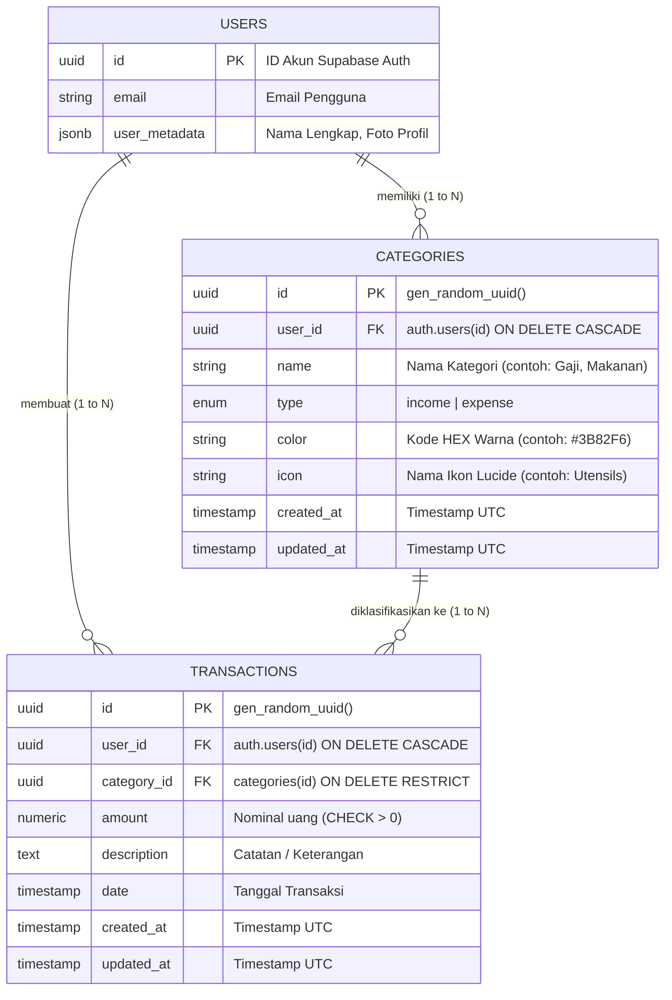

# 📄 Product Requirement Document (PRD)
## FinanceTrack – Personal & Family Finance Tracker

---

### 📌 Dokumen Kontrol & Metadata

| Properti | Keterangan |
| :--- | :--- |
| **Nama Produk** | **FinanceTrack** (Personal & Family Finance Tracker) |
| **Versi Dokumen** | v1.0.0 (Production-Ready Spec) |
| **Penyusun / Author** | **Raditya Rai Zeeshan** |
| **Status Dokumen** | Active / Baseline Implemented |
| **Target Rilis** | Q1 2026 / Implemented |
| **Platform** | Responsive Web App (Desktop, Tablet, Mobile) |
| **Tech Stack Utama** | Next.js 16 (App Router), React 19, TypeScript, Tailwind CSS v4, Supabase (PostgreSQL & Auth), Recharts |

---

## 1. 🎯 Ringkasan Eksekutif (Executive Summary)

### 1.1 Latar Belakang & Problem Statement
Banyak individu, mahasiswa, profesional muda, hingga pengelola keuangan keluarga kecil mengalami kesulitan dalam mencatat dan memonitor arus kas harian mereka:
1. **Pencatatan Berantakan:** Sebagian besar masih menggunakan catatan manual (buku/kertas) atau spreadsheet rumit yang sulit diakses secara instan lewat smartphone.
2. **Kurang Visibilitas Arus Kas:** Pengguna sering tidak mengetahui ke mana uang mereka habis di akhir bulan karena ketiadaan visualisasi analitik kategori.
3. **Privasi & Keamanan Rendah:** Aplikasi keuangan gratis pihak ketiga sering kali memperjualbelikan data keuangan pengguna atau membebankan biaya langganan yang mahal.
4. **UX Input yang Kaku:** Banyak aplikasi tidak mendukung format angka lokal Indonesia (pemisah ribuan titik/koma) sehingga pengguna sering salah memasukkan nominal (misal: mengetik `74.000` terbaca sebagai `74`).

### 1.2 Visi Produk & Solusi
**FinanceTrack** hadir sebagai aplikasi web pencatat keuangan pribadi dan keluarga modern yang **cepat, intuitif, aman, dan visual**. Dengan arsitektur modern berbasis Next.js App Router dan Supabase PostgreSQL:
- Pengguna dapat mencatat pemasukan dan pengeluaran dalam hitungan detik.
- Keamanan data terjamin 100% terisolasi per akun melalui **PostgreSQL Row Level Security (RLS)**.
- Dashboard dan laporan analitik menyajikan visualisasi grafik interaktif (distribusi persentase kategori & tren arus kas harian/bulanan).
- Format rupiah Indonesia (`Rp`, pemisah ribuan otomatis `.` ) terintegrasi secara *native* pada input formulir.

---

## 2. 👥 Analisis Target Pengguna & Persona

### 2.1 Target Pengguna
1. **Mahasiswa / Anak Kost:** Ingin membatasi pengeluaran uang saku bulanan dari orang tua dan memantau biaya makan serta kebutuhan sehari-hari.
2. **Pekerja / Freelancer:** Memiliki sumber pemasukan beragam (gaji bulanan, proyek sampingan, dividen) serta membutuhkan pelacakan pengeluaran rutin.
3. **Pasangan Muda / Rumah Tangga:** Membutuhkan transparansi pengeluaran utilitas (listrik, air, internet), belanja bulanan, dan tabungan bersama.

### 2.2 User Persona

#### Persona 1: Arya Pratama (24 Tahun, Fresh Graduate / First Jobber)
- **Karakteristik:** Baru menerima gaji pertama, terbiasa memakai smartphone, ingin menabung untuk dana darurat.
- **Pain Point:** Sering merasa uang habis di minggu ketiga tanpa tahu pos pengeluaran mana yang bocor.
- **Kebutuhan:** Dashboard ringkas dengan rasio tabungan (*savings rate*), input cepat dari HP, serta diagram lingkaran kategori pengeluaran terbesar.

#### Persona 2: Sinta & Dimas (30 Tahun, Pasangan Muda / Pengelola Keuangan Keluarga)
- **Karakteristik:** Mengelola pengeluaran rumah tangga bersama (belanja, cicilan/tagihan, kesehatan anak).
- **Pain Point:** Kategori aplikasi bawaan lain tidak fleksibel dan tidak cocok dengan pos pengeluaran keluarga di Indonesia.
- **Kebutuhan:** Kategori kustom dengan warna dan ikon yang bisa disesuaikan, serta filter riwayat transaksi lengkap.

---

## 3. 🎯 Sasaran Produk & Metrik Keberhasilan (OKRs & KPIs)

| Kategori | Indikator Kinerja Utama (KPI) | Target Keberhasilan |
| :--- | :--- | :--- |
| **User Engagement** | Waktu pencatatan transaksi baru (*time-to-log*) | ≤ 5 detik dari klik tombol hingga tersimpan |
| **Akurasi Data** | Bebas bug desimal nominal rupiah | 100% parsing nominal ribuan tepat |
| **Retensi Pengguna** | Daily / Weekly Active Users (DAU/WAU) | Pengguna rutin mencatat minimal 3x seminggu |
| **Keamanan** | Data leak antar pengguna (*data leakage*) | 0 insiden (dijamin Row Level Security di tingkat DB) |
| **Performa Web** | Google Core Web Vitals (LCP & FCP) | LCP < 1.8 detik pada jaringan 4G |

---

## 4. 🗺️ Arsitektur Informasi & Peta Situs (Sitemap)

```
FinanceTrack Web App
├── 🔒 Autentikasi
│   ├── /login (Masuk dengan Email & Password)
│   ├── /register (Daftar Akun Baru)
│   └── /auth/callback (Penanganan sesi SSR & redirect)
└── 📊 Dashboard Shell (Protected Routes)
    ├── /dashboard (Ringkasan Keuangan, Kartu Saldo, Quick Chart & Transaksi Terakhir)
    ├── /dashboard/transactions (Tabel & Kartu Riwayat Transaksi Lengkap, Filter, Pencarian, CRUD)
    ├── /dashboard/analytics (Laporan Visual, Tren Arus Kas Bar Chart, Distribusi Kategori Donut Chart)
    └── /dashboard/categories (Kelola Kategori Pemasukan & Pengeluaran, Tambah/Edit/Hapus)
```

---

## 5. 🔄 Alur Pengguna Utama (User Journey Flows)

### 5.1 Alur Pendaftaran & Auto-Seeding Kategori
1. Pengguna membuka `/register` dan menginput Nama Lengkap, Email, serta Kata Sandi.
2. Supabase Auth membuat akun baru di `auth.users`.
3. Database PostgreSQL mengeksekusi Trigger otomatis `on_auth_user_created` yang menyuntikkan (seeding) 13 kategori *default* bahasa Indonesia (5 pemasukan, 8 pengeluaran) ke tabel `public.categories`.
4. Sesi disinkronkan melalui middleware SSR, dan pengguna otomatis dialihkan langsung ke `/dashboard`.

### 5.2 Alur Pencatatan Transaksi Baru (Quick Transaction Flow)
1. Pengguna menekan tombol **"Catat Transaksi"** / **"+"** dari Header, Sidebar, Bottom Bar, atau Dashboard.
2. Modal Formulir Transaksi terbuka.
3. Pengguna memilih tipe: **Pengeluaran** atau **Pemasukan**.
4. Pengguna mengetik nominal (misal: `75000` -> input memformat otomatis menjadi tampilan `75.000`).
5. Pengguna memilih Kategori dari dropdown.
   - *Kasus Khusus:* Jika kategori **"Lainnya"** dipilih, form mengaktifkan validasi wajib mengisi kolom Deskripsi / Sumber Dana.
6. Pengguna memilih tanggal transaksi (default: hari ini).
7. Pengguna menekan tombol Simpan.
8. Data tersimpan ke Supabase PostgreSQL, state global diperbarui secara reaktif, dan seluruh metrik saldo/grafik terhitung ulang seketika (*instant balance update*).

---

## 6. 📋 Kebutuhan Fungsional (Functional Requirements)

### Modul 1: Autentikasi & Manajemen Sesi Pengguna (AUTH)

| Kode | Kebutuhan Fungsional | Prioritas | Deskripsi & Acceptance Criteria |
| :--- | :--- | :--- | :--- |
| **FR-AUTH-01** | Pendaftaran Akun | P0 (Must) | Pengguna dapat mendaftar dengan nama lengkap, email valid, dan password minimal 6 karakter. |
| **FR-AUTH-02** | Masuk Akun (Login) | P0 (Must) | Pengguna dapat masuk menggunakan email dan password terdaftar. Sesi dikelola via secure cookies via `@supabase/ssr`. |
| **FR-AUTH-03** | Auto-Seeding Kategori Default | P0 (Must) | Setiap registrasi akun baru otomatis mendapatkan kategori dasar (Gaji, Uang Ortu, Makanan, Transport, dll.) tanpa konfigurasi manual. |
| **FR-AUTH-04** | Proteksi Rute (Middleware) | P0 (Must) | Halaman `/dashboard/*` tidak dapat diakses pengguna tanpa login. Pengguna yang sudah login yang mengakses `/login` otomatis dialihkan ke `/dashboard`. |
| **FR-AUTH-05** | Keluar Akun (Logout) | P0 (Must) | Pengguna dapat keluar akun dengan sekali klik dari Sidebar / Menu Pengguna; sesi cookie dibersihkan dan dialihkan ke `/login`. |

---

### Modul 2: Dashboard & Metrik Finansial Ringkas (DASH)

| Kode | Kebutuhan Fungsional | Prioritas | Deskripsi & Acceptance Criteria |
| :--- | :--- | :--- | :--- |
| **FR-DASH-01** | Dynamic User Greeting | P1 (High) | Menampilkan nama pengguna atau email prefix dengan badge sambutan visual. |
| **FR-DASH-02** | Kartu Ringkasan Saldo (Summary Cards) | P0 (Must) | Menampilkan 4 kartu metrik utama:<br>1. **Total Saldo Bersih** (Akumulasi Pemasukan - Pengeluaran)<br>2. **Pemasukan Bulan Ini**<br>3. **Pengeluaran Bulan Ini**<br>4. **Rasio Tabungan Bulan Ini (%)** |
| **FR-DASH-03** | Grafik Arus Kas Ringkas | P1 (High) | Visualisasi perbandingan pemasukan vs pengeluaran 6 bulan terakhir atau harian secara dinamis menggunakan Recharts. |
| **FR-DASH-04** | Widget Transaksi Terbaru | P1 (High) | Menampilkan 5 transaksi terakhir lengkap dengan ikon kategori, tipe badge, tanggal humanis, nominal format Rupiah, dan aksi edit cepat. |
| **FR-DASH-05** | Modal Aksi Cepat (Quick Add) | P0 (Must) | Tombol aksi cepat untuk mencatat transaksi baru langsung dari dashboard tanpa harus berpindah halaman. |

---

### Modul 3: Manajemen Transaksi (TXN)

| Kode | Kebutuhan Fungsional | Prioritas | Deskripsi & Acceptance Criteria |
| :--- | :--- | :--- | :--- |
| **FR-TXN-01** | Pencatatan Transaksi Baru | P0 (Must) | Form mendukung pemilihan tipe (Pemasukan/Pengeluaran), nominal uang, kategori, tanggal, dan deskripsi/catatan opsional. |
| **FR-TXN-02** | Format Angka Lokal Indonesia (Dot Separator) | P0 (Must) | Input nominal memformat input secara real-time dengan titik pemisah ribuan (contoh: `100000` menjadi `100.000`) dan mem-parse angka dengan bersih ke integer sebelum disimpan ke database. |
| **FR-TXN-03** | Logika Validasi Kategori "Lainnya" | P1 (High) | Apabila pengguna memilih kategori bernama "Lainnya" (atau "Other"), formulir mewajibkan pengisian deskripsi untuk menjamin akuntabilitas pengeluaran tak terduga. |
| **FR-TXN-04** | Riwayat Transaksi Lengkap | P0 (Must) | Tabel riwayat transaksi dengan pagination/infinite scroll, mendukung tampilan desktop (tabel) dan mobile (kartu responsif). |
| **FR-TXN-05** | Pencarian Real-Time | P1 (High) | Pencarian kata kunci instan berdasarkan nama kategori atau catatan deskripsi transaksi. |
| **FR-TXN-06** | Filter Multi-Kriteria | P1 (High) | Filter berdasarkan tipe (Semua, Pemasukan, Pengeluaran) dan dropdown filter berdasarkan Kategori spesifik. |
| **FR-TXN-07** | Edit Transaksi | P0 (Must) | Pengguna dapat mengubah nominal, kategori, tanggal, maupun deskripsi transaksi yang telah tersimpan sebelumnya. |
| **FR-TXN-08** | Hapus Transaksi | P0 (Must) | Pengguna dapat menghapus transaksi dengan dialog konfirmasi, memicu rekalkulasi saldo otomatis. |

---

### Modul 4: Laporan & Analitik Finansial (ANL)

| Kode | Kebutuhan Fungsional | Prioritas | Deskripsi & Acceptance Criteria |
| :--- | :--- | :--- | :--- |
| **FR-ANL-01** | Filter Rentang Waktu (Time Period) | P1 (High) | Analitik mendukung pemfilteran multi-rentang: 7 Hari Terakhir (`7d`), 30 Hari Terakhir (`30d`), 3 Bulan (`3m`), 6 Bulan (`6m`), dan 12 Bulan (`12m`). |
| **FR-ANL-02** | Grafik Batang Komparasi Arus Kas | P0 (Must) | Bar chart interaktif membandingkan Pemasukan vs Pengeluaran per hari atau per bulan dengan tooltip informatif dan nilai saldo bersih. |
| **FR-ANL-03** | Diagram Donat / Pie Distribusi Kategori | P0 (Must) | Donut chart yang menampilkan persentase alokasi dana per kategori, lengkap dengan palet warna dinamis dan hover detail. |
| **FR-ANL-04** | Toggle Tipe Laporan Kategori | P1 (High) | Tab toggle untuk beralih antara melihat Distribusi Pengeluaran atau Distribusi Pemasukan. |
| **FR-ANL-05** | Tabel Peringkat Kategori (Category Rankings) | P1 (High) | Tabel rincian pengeluaran per kategori yang dilengkapi progress bar persentase, total nominal, dan frekuensi transaksi. |

---

### Modul 5: Manajemen Kategori Kustom (CAT)

| Kode | Kebutuhan Fungsional | Prioritas | Deskripsi & Acceptance Criteria |
| :--- | :--- | :--- | :--- |
| **FR-CAT-01** | Pemisahan Tab Kategori | P1 (High) | Kategori dikelompokkan secara rapi menjadi 2 tab: **Pemasukan** dan **Pengeluaran**. |
| **FR-CAT-02** | Tambah Kategori Baru | P0 (Must) | Pengguna dapat membuat kategori kustom dengan memilih Nama, Tipe, Warna Tema (12 opsi palet), dan Ikon (19 opsi Lucide Icon). |
| **FR-CAT-03** | Edit Kategori | P1 (High) | Pengguna dapat mengubah nama, warna, dan ikon kategori yang sudah ada. Transaksi yang terhubung akan otomatis menampilkan tampilan yang diperbarui. |
| **FR-CAT-04** | Proteksi Integritas Hapus Kategori | P0 (Must) | Sistem menolak penghapusan kategori jika kategori tersebut sedang digunakan oleh transaksi aktif (*referential integrity protection*), dengan pesan peringatan yang ramah. |

---

## 7. 🔒 Kebutuhan Non-Fungsional (Non-Functional Requirements)

### 7.1 Keamanan & Privasi Data (Security)
1. **Row Level Security (RLS):** Seluruh tabel PostgreSQL (`categories`, `transactions`) dilindungi RLS ketat dengan aturan `auth.uid() = user_id`. Pengguna mustahil membaca atau mengubah data pengguna lain bahkan jika mengeksekusi request langsung melalui API client.
2. **Koneksi Terenkripsi:** Komunikasi data wajib menggunakan HTTPS dengan sertifikat SSL/TLS.
3. **Session Cookies:** Menggunakan cookies `httpOnly`, `sameSite=lax`, dan `secure` melalui `@supabase/ssr`.

### 7.2 Performa & Kecepatan (Performance)
1. **Database Indexing:** Mengindeks kolom krusial (`user_id`, `category_id`, `date DESC`, `(user_id, date DESC)`) untuk menjamin query data transaksi tetap sub-detik (< 100ms) meskipun data mencapai puluhan ribu entri per pengguna.
2. **Client State Cache:** Penggunaan `FinanceContext` meminimalisasi re-fetching berlebih dan memberikan respon antarmuka yang instan tanpa loading spinner berkepanjangan.

### 7.3 Responsivitas & Desain Antarmuka (UI/UX)
1. **Mobile-First Design:** 
   - Pada layar Desktop: Navigasi Sidebar kiri yang kokoh dengan profil pengguna dan tombol aksi cepat.
   - Pada layar Mobile/Tablet: Navigasi Header ringkas dengan tombol hamburger plus **Bottom Navigation Bar** untuk kemudahan akses jempol satu tangan (*one-handed thumb zone*).
2. **Tipografi:** Menggunakan font modern **Plus Jakarta Sans** yang bersih dan mudah dibaca pada berbagai ukuran layar.
3. **Standar Mata Uang:** Semua angka diformat sesuai kaidah Rupiah Indonesia (`Rp 1.500.000`).

---

## 8. 🗄️ Model Data & Skema Database

### 8.1 Entity Relationship Diagram (ERD Konseptual)



### 8.2 Definisi Tabel & Integritas Relasi

#### Tabel: `public.categories`
| Kolom | Tipe Data | Constraint | Keterangan |
| :--- | :--- | :--- | :--- |
| `id` | `UUID` | PRIMARY KEY, `gen_random_uuid()` | ID unik kategori |
| `user_id` | `UUID` | NOT NULL, REFERENCES `auth.users(id)` ON DELETE CASCADE | Pemilik kategori |
| `name` | `VARCHAR(100)` | NOT NULL | Nama kategori |
| `type` | `transaction_type` | NOT NULL (ENUM: `'income'`, `'expense'`) | Tipe kategori |
| `color` | `VARCHAR(20)` | DEFAULT `'#3B82F6'` | Warna tema representasi |
| `icon` | `VARCHAR(50)` | DEFAULT `'Tag'` | Ikon Lucide representasi |
| `created_at` | `TIMESTAMPTZ` | DEFAULT `now()` | Waktu pembuatan |
| `updated_at` | `TIMESTAMPTZ` | DEFAULT `now()` | Waktu update |
| *Constraint Khusus* | `UNIQUE` | `(user_id, name, type)` | Mencegah duplikasi nama kategori bertipe sama |

#### Tabel: `public.transactions`
| Kolom | Tipe Data | Constraint | Keterangan |
| :--- | :--- | :--- | :--- |
| `id` | `UUID` | PRIMARY KEY, `gen_random_uuid()` | ID unik transaksi |
| `user_id` | `UUID` | NOT NULL, REFERENCES `auth.users(id)` ON DELETE CASCADE | Pemilik transaksi |
| `category_id` | `UUID` | NOT NULL, REFERENCES `public.categories(id)` ON DELETE RESTRICT | Relasi ke kategori (proteksi hapus) |
| `amount` | `NUMERIC(15, 2)` | NOT NULL, CHECK (`amount > 0`) | Nominal transaksi |
| `description` | `TEXT` | NULLABLE | Catatan / rincian transaksi |
| `date` | `TIMESTAMPTZ` | NOT NULL, DEFAULT `now()` | Tanggal kejadian transaksi |
| `created_at` | `TIMESTAMPTZ` | DEFAULT `now()` | Waktu pembuatan entri |
| `updated_at` | `TIMESTAMPTZ` | DEFAULT `now()` | Waktu update entri |

---

## 9. ⚙️ Logika Bisnis & Edge Cases (Edge Cases Handling)

1. **Bug Pemisah Ribuan (Thousand Separator Edge Case):**
   - *Masalah:* Pengguna mengetik `74.000`. Jika menggunakan `parseFloat("74.000")`, JavaScript membacanya sebagai desimal `74`.
   - *Penanganan:* Fungsi `parseCurrencyInput()` membersihkan seluruh karakter non-digit `\D` terlebih dahulu sehingga string `"74.000"` dikonversi secara akurat menjadi integer `74000`.
2. **Kategori Default Terhapus:**
   - *Penanganan:* Jika pengguna baru dibuat, sistem otomatis menyuntikkan 13 kategori standar melalui database trigger. Jika seluruh kategori terhapus atau kosong, `FinanceContext` memiliki skema *fallback auto-reseed*.
3. **Penghapusan Kategori yang Sedang Digunakan:**
   - *Penanganan:* Database memberlakukan aturan `ON DELETE RESTRICT`. Antarmuka aplikasi melakukan pra-pemeriksaan di frontend dan menampilkan notifikasi instruksi agar pengguna memindahkan atau menghapus transaksi terkait terlebih dahulu sebelum menghapus kategori.
4. **Validasi Wajib untuk Pos "Lainnya":**
   - *Penanganan:* Form transaksi memeriksa apakah kategori yang dipilih mengandung kata "Lainnya" atau "Other". Jika ya, kolom deskripsi wajib diisi agar pos pengeluaran tidak menjadi "dana gelap" tanpa keterangan.

---

## 10. 🚀 Rencana Pengembangan Masa Depan (Future Roadmap)

### Fase 2 (Q2 2026) – Fitur Anggaran & Ekspor Data
- [ ] **Sistem Budgeting Bulanan:** Pengguna dapat menetapkan pagu anggaran per kategori (misal: Makan maksimal Rp 2.000.000/bulan) dan menerima indikator *warning* ketika mencapai 80% kuota.
- [ ] **Ekspor Laporan Finansial:** Download riwayat transaksi ke format **CSV**, **Microsoft Excel (.xlsx)**, dan **PDF Summary Report**.
- [ ] **Multi-Wallet / Multi-Akun:** Pencatatan berdasarkan rekening/dompet terpisah (misal: Rekening BCA, Dompet Tunai, GoPay, ShopeePay, Bibit).

### Fase 3 (Q3 2026) – AI & Otomasi Cerdas
- [ ] **Smart Receipt Scanning (OCR AI):** Foto struk belanja (Indomaret, Alfamart, restoran), lalu AI membaca nominal, tanggal, dan mencocokkan kategori secara otomatis.
- [ ] **Pemberitahuan Tagihan Berulang (Recurring Bills):** Fitur auto-remind untuk tagihan bulanan (Listrik PLN, WiFi Indihome, BPJS, Spotify).
- [ ] **Family Shared Budget:** Fitur berbagi buku kas bersama pasangan/anggota keluarga dengan hak akses peran (*Role-Based Access: Admin / Contributor*).

---

## 11. 👨‍💻 Hak Cipta & Kepemilikan

Dokumen Persyaratan Produk (PRD) ini disusun secara resmi untuk pengembangan dan dokumentasi proyek **FinanceTrack**.

- **Pemilik Proyek & Penulis:** Raditya Rai Zeeshan
- **Lisensi:** Proprietary / Private Project
- **Tahun Pembuatan:** 2026
